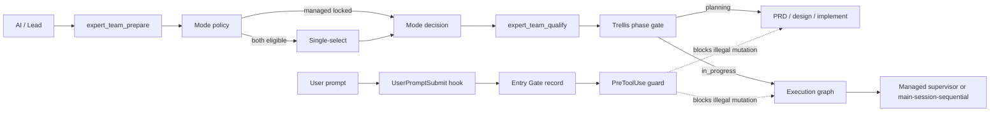
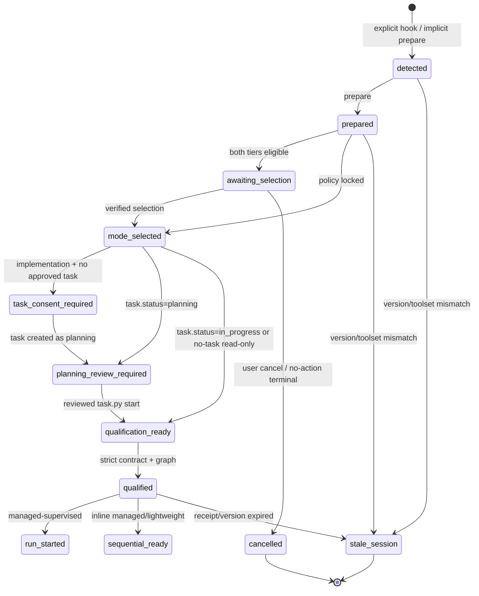

# Technical Design: Expert Team 模式选择与强制遵循

## 1. Decision summary

建立一个独立但很小的 **Entry Gate**，只负责 Expert Team 调用进入 Trellis/managed runtime 之前的模式评估、用户选择和阶段许可。它不复制 Trellis task 状态，也不重写现有 Supervisor。

核心改动只有四层：

1. `runtime/routing.py`：唯一的纯函数模式策略 owner；
2. entry-gate contract/store：记录 invocation、评估、用户决定和资格凭据；
3. MCP service：强制合法转换，拒绝跳过 prepare/selection/qualification；
4. plugin hooks + skill adapter：呈现单选并拦截支持的越阶段写操作。



## 2. Design invariants

- 模式策略只有一个实现；skill、hook 和 README 只消费结果。
- `requested_tier` 是偏好，`effective_tier` 不能低于 `policy_floor`。
- user attribution 必须来自宿主事件或服务器主持的选择；AI 自报只能标记 unverified。
- `managed`、`inline` 与 assurance capability 分开；inline 不能触发 tier 降级，也不能被包装成独立审计。
- Trellis `task.json` 是项目生命周期权威；Entry Gate 只引用 task ID/status/version。
- managed run 仍由现有 `TrellisRunStore` / Supervisor 权威管理。
- 每个 mutation API 自己验证前置凭据，不能仅依靠调用顺序说明。
- hook 是强守卫但不是 sandbox；无法覆盖的工具路径要公开显示，不得虚报绝对强制。

## 3. Data contracts

### 3.1 `ModeAssessment` (schema version 2)

```json
{
  "schema_version": 2,
  "invocation_id": "uuid",
  "request_fingerprint": "sha256:...",
  "intent": "analysis|implementation|audit",
  "invocation_kind": "explicit|implicit",
  "policy_floor": "lightweight|managed",
  "allowed_tiers": ["managed"],
  "recommended_tier": "managed",
  "decision_state": "policy_locked|selection_required|resolved|stale_session",
  "reasons": [
    {"code": "active_trellis_task", "source": "trellis", "detail": "..."}
  ],
  "host": {
    "execution_mode": "main-session-sequential",
    "assurance_capabilities": ["lead_verification", "durable_state"],
    "selection_surface": "native_single_select|elicitation|plain_reply|none",
    "enforcement_level": "enforced|partial|advisory"
  },
  "trellis": {
    "task_id": "...",
    "task_status": "planning|in_progress|null"
  },
  "next_action": "select_mode|request_task_consent|planning_review|build_graph|stale_session"
}
```

`reasons[].source` 只能来自服务器可核验事实：Trellis metadata、严格 graph、受信任宿主事件、显式安全配置。调用方提供的布尔值保留为 hints，但不能单独降低 policy floor。

若 acceptance contract 要求 `independent_audit`，但 `assurance_capabilities` 不包含该能力，assessment/qualification 返回 `capability_blocked`；不得把主会话自检描述为独立 Auditor。

### 3.2 `ModeDecision`

```json
{
  "schema_version": 1,
  "invocation_id": "uuid",
  "selected_tier": "managed|lightweight",
  "actor": "user|policy",
  "source": "policy|mcp_elicitation|host_single_select|user_prompt|legacy_unverified",
  "source_event_id": "optional host event id",
  "verification": "verified|host_reported|unverified",
  "timestamp": "RFC3339",
  "assessment_fingerprint": "sha256:..."
}
```

Rules:

- `policy` 只能选择 assessment 的 policy floor；
- `legacy_unverified` 只能升级为 managed，不能选 lightweight；
- lightweight 必须在 `allowed_tiers` 内，且 assessment fingerprint 未过期；
- 同一 invocation 的同值重复提交幂等，冲突值进入 `needs_input`，不覆盖历史。

### 3.3 `QualificationReceipt`

```json
{
  "schema_version": 1,
  "qualification_id": "uuid",
  "invocation_id": "uuid",
  "effective_tier": "managed",
  "execution_mode": "main-session-sequential",
  "task_id": "stable task id",
  "task_status": "in_progress",
  "contract_fingerprint": "sha256:...",
  "graph_fingerprint": "sha256:...",
  "issued_at": "RFC3339"
}
```

Receipt 由服务器根据严格 `TaskContract`、`WorkItem[]`、mode decision 和实时 Trellis 状态生成。`expert_team_start` 必须验证 receipt 与请求的 task/contract/graph 完全一致。

### 3.4 `EntryGateRecord`

只保存恢复所需的小型事实：invocation ID、session/turn 引用、prompt fingerprint、assessment、append-only decisions、qualification receipt、Trellis reference、版本和最后状态。不得保存完整 prompt 或 raw trajectory。

## 4. Mode policy

### 4.1 Pure assessment

将 `qualify_execution_tier(...) -> Literal` 替换为一个返回 `ModeAssessment` 的纯策略函数；为了减少迁移风险，可保留一个只读 compatibility projection，但所有 MCP 路径必须消费完整 assessment。

优先级从高到低：

1. **Stale/invalid**：版本或工具合同不一致，停止；
2. **Managed hard floor**：Trellis/持久化/多波次/审计/门禁/高风险事实；
3. **Verified user managed**：安全升级；
4. **Selection required**：两种模式均合法但无已验证选择；
5. **Verified user lightweight**：仅在 eligibility 全部满足时；
6. **No verified decision**：保持 unresolved，不默认 lightweight。

旧 `explicit` 字段迁移语义：

| Legacy input | New meaning |
| --- | --- |
| `explicit=managed` | unverified managed upgrade，可立即满足 tier 但 actor 不是 user |
| `explicit=lightweight` | unverified preference，进入 selection_required；不能覆盖 hard floor |
| omitted | 正常 assessment |

### 4.2 Graph requalification

prepare 只能基于入口事实给出初步 assessment。qualification 收到严格 graph 后必须重新计算：

- `dependency_waves > 1`；
- required verify/audit gate；
- 跨 package/layer ownership；
- active Trellis implementation；
- durable outputs。

如果 graph 把原本可 lightweight 的任务提升到 managed，返回 `mode_conflict` 并重新呈现选择；不能静默改 tier，也不能继续执行。

## 5. Entry-gate state machine



Entry Gate 不新增 `completed` 项目状态。执行后的 check/spec/commit/finish 继续由 Trellis 和 Expert Result Contract 决定。

## 6. Trellis integration

Trellis 的 G0-G6 概念被用于门禁，但不照搬其当前的提示词缺口：

| Gate | Source of truth | Expert Team behavior |
| --- | --- | --- |
| G0 mode/task consent | EntryGate decision + attributable user event | 无凭据不创建 task，不声称同意 |
| G1 planning ready | `prd.md`, `design.md`, `implement.md`, convergence result | complex task 缺任一文件则保持 planning |
| G2 start approval | user review event + `task.py start` result | receipt 记录 task metadata version/status |
| G3 check | Auditor decision / inline full-scope check evidence | 失败产生新 repair attempt，最多两轮 |
| G4 spec | `updated(files)` 或 `not_needed(reason)` | 必须有显式结论 |
| G5 commit | commit plan decision + hashes / manual confirmation | 不混入未知脏文件，不自动 push |
| G6 finish | required work accepted + clean/approved handoff | 才允许 archive/finish |

现有 Trellis 脚本并未强制所有规划与完成门禁，因此不能把 `task.py start/archive` 的成功退出码当成全部合规证明。Entry Gate/最终合规检查需要附带自己的证据。

父子任务只表示组织关系，不推断 WorkItem dependency。派发/恢复必须显式携带 `task_path`、`run_id` 和 `work_item_id`，不能依赖 subagent 的 session current pointer。

## 7. Host interaction adapter

### 7.1 Selection surface order

1. MCP/宿主能够直接产生可归因单选时使用该能力；
2. Codex 暴露 `request_user_input` 且当前 mode 允许时，渲染 2 项单选；
3. Claude 支持 MCP Elicitation 时，由服务器请求表单选择并直接接收结果；
4. 不支持原生交互时，返回 `needs_input`，Lead 只问一条明确选择问题并结束该 turn；下一条 `UserPromptSubmit` 事件完成 attribution；
5. 非交互运行没有预先验证决定时返回 no-action/needs-input，不设默认值。

跨宿主基线不能依赖自定义 UI。MCP App/dashboard 保持 out of scope。

### 7.2 Single-select payload

```json
{
  "question": "本次 Expert Team 使用哪种执行模式？",
  "options": [
    {
      "value": "managed",
      "label": "Managed Expert Team（推荐）",
      "description": "Trellis 状态、独立审计、恢复与完整留痕"
    },
    {
      "value": "lightweight",
      "label": "Lightweight Expert Team",
      "description": "单会话、无持久化审计，仅在当前任务符合条件时可选"
    }
  ],
  "recommended": "managed",
  "min": 1,
  "max": 1
}
```

策略锁定 managed 时不返回一个可被误解为自由选择的两项控件，只显示锁定原因和“取消/缩小范围重新评估”。

## 8. Hook enforcement

### 8.1 `UserPromptSubmit`

- 检测显式 Expert Team invocation；
- 生成 session-scoped invocation ID 并写入 plugin data；
- 将 invocation ID、contract version、当前 gate 状态作为最小 additional context 注入；
- 不把完整用户 prompt 写入持久化，只保存 hash 和必要标志。

### 8.2 `PreToolUse`

根据 gate/Trellis phase 对受支持工具进行 fail-closed 判断：

| Phase | Allowed | Blocked examples |
| --- | --- | --- |
| detected/awaiting_selection | prepare/select/status only | Bash、apply_patch、start、managed mutation |
| task_consent_required | read-only status + user interaction | task create、source edits |
| planning | read-only inspection + approved task artifact writes | source edits、`task.py start` without review receipt |
| qualified/in_progress | contract-owned writes and planned checks | out-of-scope ownership, bypass lifecycle calls |
| stale/cancelled | refresh/status only | all project/run mutations |

Hook 使用一个跨平台无第三方依赖的入口，并将 session ID 与 project root 一同作为查找键。工具覆盖以宿主官方 hook 能力为准；hosted/specialized tools 若不经过 hook，诊断必须报告 `partial`。

### 8.3 State location

优先级：

1. Trellis 项目：`.trellis/.runtime/expert-team/entry-gates/<session-id>/<invocation-id>.json`；
2. 非 Trellis 插件：`PLUGIN_DATA/entry-gates/...`；
3. 两者都不可用：仅内存 advisory gate，禁止声称可跨会话恢复。

使用原子临时文件 + replace；锁/版本冲突失败关闭。状态目录必须 gitignored。

## 9. MCP API changes

### `expert_team_prepare`

- schema v2 新增 `invocation_id`、host capability/version inputs；
- 返回完整 ModeAssessment 和 gate state；
- 同 invocation 幂等；
- 对项目/managed run 仍无副作用，但允许写 plugin-local entry-gate metadata，并在文档中明确这一区别。

### `expert_team_select_mode` (new)

- 接收 invocation、selection、可信 source reference；
- 校验 allowed tiers/fingerprint/actor；
- 支持 `cancel`；
- 返回 decision 与下一 Trellis action。

### `expert_team_qualify`

- 必须接收 invocation ID、strict TaskContract、strict WorkItem graph；
- 重新评估 graph；
- 生成 QualificationReceipt；
- 仅显式 `auto_start=true` 且 receipt 合法时创建 managed run。

### `expert_team_start`

- 保留恢复/底层集成用途，但新增 qualification receipt；
- 正常路径缺 receipt fail closed；
- 若确需 break-glass，必须是单独、显式、可审计的管理员能力，不通过普通工具 schema 暴露。

### Existing run tools

`status/resume/answer/cancel/run/submit_*` 继续使用现有 managed state machine。只有创建/启动边界增加 receipt 验证，不重写执行 reducer。

## 10. Version and stale-session contract

MCP initialize、hook record、skill metadata 和 prepare response 必须共享：

- package base version；
- Codex cachebuster version；
- entry-gate contract version；
- MCP toolset fingerprint；
- hook schema version。

任一不一致：

```text
state = stale_session
next_action = refresh_plugin_and_open_new_session
mutation_allowed = false
```

安装验证必须从 cache 路径启动 server 并调用 tools/list，不能只验证 checkout。旧会话不尝试热补丁；官方插件行为要求新 chat/CLI session 才加载新的 bundled skills，因此 README 必须明确重开会话。

## 11. Idempotency, recovery, and no-action

- `prepare(invocation_id)`：相同 request fingerprint 返回同一 assessment；不同 request 冲突。
- `select_mode`：同值重复成功，异值重复进入 needs_input。
- `qualify`：相同 assessment/decision/contract/graph 返回同一 receipt。
- `auto_start`：task/run/idempotency key 相同返回现有 run；内容冲突失败。
- 用户取消/超时/无交互：gate 终态或 pending，不创建 task/run。
- MCP crash：从 gate JSON + Trellis task + run event log 对账；不从聊天摘要恢复。
- compact/new thread：SessionStart 注入最小 gate/task/run 摘要；原始 transcript 仅诊断。
- 已完成/取消 gate 的迟到操作拒绝；accepted managed work 不重复。

## 12. Compliance projection

最终输出由一个只读 projection 生成：

```json
{
  "entry_gate": {"prepared": true, "decision": "managed", "source": "user", "enforcement": "enforced"},
  "qualification": {"id": "...", "tier": "managed", "execution_mode": "main-session-sequential"},
  "trellis": {"task": "...", "phase": "in_progress"},
  "work_graph": {"required": 4, "accepted": 4},
  "verification": {"status": "passed", "checks": []},
  "incomplete": [],
  "result": "success"
}
```

`result=success` 的 validator 必须验证所有必需字段和证据引用，而不是信任 Lead 文本。

## 13. Trusted workspace binding

当前 MCP 进程从插件安装根启动，不能再把 process `cwd` 当成用户项目。新协议使用宿主事件捕获的 workspace context：

```text
UserPromptSubmit / SessionStart cwd
        -> canonical realpath + workspace fingerprint
        -> EntryGateRecord
        -> task lookup constrained beneath <workspace>/.trellis/tasks
        -> QualificationReceipt
        -> every run/status/resume mutation rechecks binding
```

Rules:

- hook 捕获的 session/cwd 是首选可信来源；AI 传入的 `project_root` 只作 fallback hint；
- canonical workspace 必须存在，task path 必须位于其 `.trellis/tasks` 下；
- invocation、qualification 和 run 都绑定 workspace fingerprint，不能借用另一个 `in_progress` 父任务；
- `cwd` 中途变化、软链接逃逸、project removed 或 task metadata drift 都返回 `workspace_unbound|task_drift`；
- MCP package root 只用于加载代码/manifest，绝不参与用户 task 查找；
- 非 Trellis lightweight read-only 可绑定 workspace 但不创建 task/run。

这要求把 `ExpertTeamService(repo_root=Path.cwd())` 改为“插件运行时根 + request-scoped workspace”两种明确概念，所有 store factory 都从 verified workspace 构造。

## 14. Trusted human decisions

Mode selection 不是唯一的人工作用点。现有 `HumanDecision.actor` 自报字符串必须统一迁移到 `DecisionProvenance`：

- `mode_selection`、`task_creation`、`planning_start`、`completion`、`permission`、`cancel` 使用同一来源枚举和验证级别；
- verified 决定必须引用 MCP elicitation、host single-select/UserPromptSubmit 或管理员策略事件；
- legacy MCP payload 可保留 instruction/decision 内容，但 actor/source 为 unverified，不能批准 completion 或降低 policy floor；
- Auditor accepted 仍不能替代 human completion gate；human gate 也不能替代 Auditor evidence。

## 15. Compatibility and migration

1. 引入 schema v2 和新 select tool；保留旧字段一个发布周期。
2. 旧 `explicit=managed` 安全升级；旧 lightweight 变为待确认，不保留危险覆盖路径。
3. 行为变化发布必须同时提升 Codex/Claude base version；Codex 在相同 base 上可再附加 cachebuster，但不能只更新 Codex。随后同步 runtime/tool schemas、skill/hooks/docs。
4. 新版本安装后必须重开会话并执行 installed-cache smoke。
5. 回滚时可移除 hooks 并恢复旧 package，但新 gate records 保留只读；不得自动删除用户审计数据。

## 16. Risks and controls

| Risk | Control |
| --- | --- |
| AI 伪造 user source | server 验证 host event；unverified 不能降级 |
| hook 被禁用/不受信任 | enforcement level 显示 advisory，managed start 可继续要求 receipt |
| hook 误拦只读命令 | 按 phase 明确 allowlist，fixture 覆盖 Windows/Linux commands |
| 多 session 争用 | session/invocation key + atomic versioned writes |
| task context drift | receipt 绑定稳定 task ID、status/version/path |
| installed MCP 误用 plugin cwd | verified workspace binding，package root 与 project root 分离 |
| AI 伪造人工 completion | 所有 HumanDecision 使用统一 provenance 验证 |
| policy 在 skill/runtime 重复 | routing.py 唯一 owner，其他层只渲染 |
| 兼容层永久存在 | 一个发布周期后删除旧 explicit semantics |
| 当前脏工作区被误提交 | 所有提交按明确文件清单，未知脏文件保持排除 |

## 17. Deliberate trade-offs

- 选择 plugin hooks 而不是只增强提示词，因为真实失守发生在 AI 无视返回值时；需要宿主工具边界上的阻断。
- 不上自定义 UI；单选优先复用宿主能力，降低跨平台维护成本。
- 不声称 hooks 是安全边界；它们提高命令遵循度，真正权限仍由宿主 sandbox/approval 决定。
- 不让用户“强行 lightweight”覆盖与需求矛盾的 hard managed 条件；用户可以取消或缩小任务范围后重新评估。
