# Multi Teammates Agents 系统流程与交付状态说明

> 文档状态：工程交付基线（Alpha）
> 核验日期：2026-08-09
> 适用版本：`multi-teammates-agents@0.5.0-alpha.0`
> 代码基线：`main@dedc88e`
> 系统简称：MTA（Multi Teammates Agents）

## 1. 结论

当前重构的**工程流程问题已经解决并形成闭环**：npm 安装包、TypeScript 运行时、项目接管与回滚、Trellis 任务生命周期、Hook、MCP、TUI、Codex/Claude 宿主适配、长任务编排、独立审计、持久化恢复、进程取消、无 Python/Cargo 安装验证和四平台 CI 均已落地。

但当前只能准确标记为 **Alpha 工程完成**，不能标记为“已正式稳定发布”。剩余两项不是代码流程缺陷，而是需要外部账号或发布授权的门禁：

1. Claude Code 当前未登录，尚未完成 Claude 真实模型的 managed E2E。
2. npm registry 尚无已发布的 alpha，尚未执行真实 registry 的安装、精确升级、失败回滚演练。

因此，当前状态是：

| 范围 | 状态 | 说明 |
|---|---:|---|
| TypeScript/npm 重构 | ✅ 完成 | 单包、ESM-only、Node.js 22+ |
| 本地产品流程 | ✅ 完成 | 安装、apply、运行、恢复、unapply 均有证据 |
| Codex 真实 managed E2E | ✅ 完成 | Manager → Executor → Auditor → completion |
| 四平台远程 CI | ✅ 完成 | 8/8 矩阵通过 |
| Claude 真实 managed E2E | ⛔ 外部门禁 | `claude auth status` 显示未登录 |
| npm 真实发布/升级回滚 | ⛔ 外部门禁 | registry 返回 E404，未获得 publish 授权 |
| Stable 发布 | ⏳ 未达到 | 必须先通过 Claude 与 registry 门禁 |

## 2. 系统标识与版本基线

| 项目 | 当前值 |
|---|---|
| 系统全名 | Multi Teammates Agents |
| 系统简称 | MTA |
| npm 包名 | `multi-teammates-agents` |
| 当前版本号 | `0.5.0-alpha.0` |
| 命令名 | `mta`、`multi-teammates-agents` |
| 运行时 | ESM-only TypeScript / Node.js `>=22` |
| 正式支持宿主 | Codex CLI、Claude Code |
| 项目任务权威 | `.trellis/tasks/` |
| 新运行数据目录 | 活动任务下的 `mta-runs/` |
| 项目接管回执 | `.mta/apply-receipt.json` |
| 公共契约 | Zod → `schemas/mta/v1/*.schema.json` |
| 许可证 | MIT |
| 远程仓库 | `five-five0909/multi-teammates-agents` |
| 最新核验提交 | `dedc88e8eda44a49b3f9cb647367630b815eab38` |
| 最新通过 CI | [GitHub Actions 31298502025](https://github.com/five-five0909/multi-teammates-agents/actions/runs/31298502025) |

## 3. 系统总体架构

系统只有一套 TypeScript 产品路径。Codex 与 Claude 仅在宿主事件和进程参数边界分叉，任务、运行状态、审计规则和持久化实现全部共享。

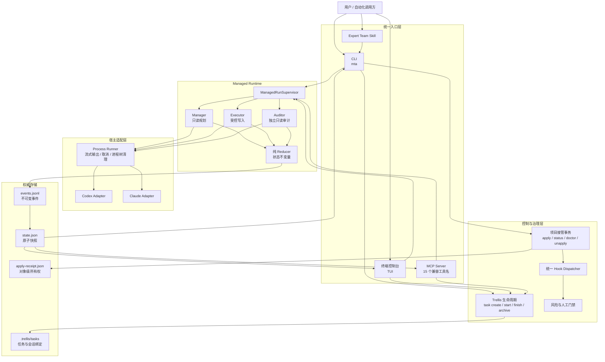

## 4. 项目接管与安全回滚流程

`apply` 不是直接覆盖配置，而是“预览计划 → 校验并发漂移 → 原子提交 → 写入所有权回执”。`unapply` 只撤销回执能证明属于 MTA 且未被用户改动的内容。

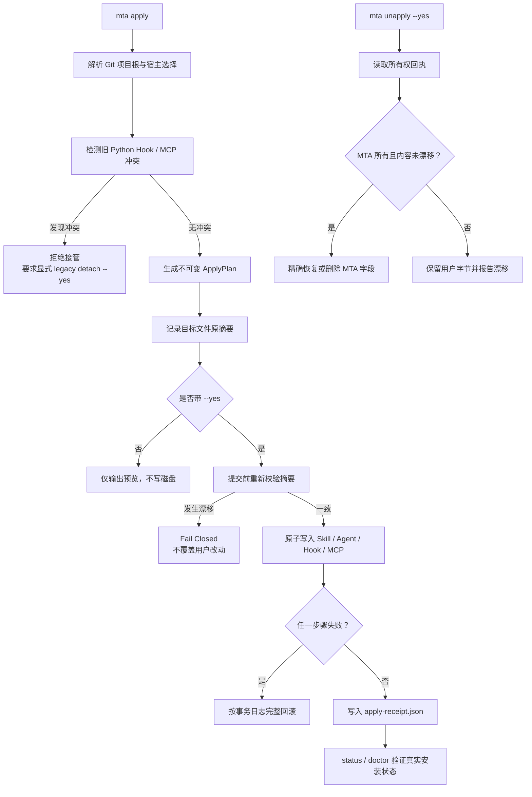

该流程保证：重复 apply 幂等、并发修改不会被覆盖、中途失败能恢复、旧任务和旧 run 不迁移也不删除。

## 5. Trellis 任务生命周期

`.trellis/tasks/` 是唯一任务权威。复杂任务在获得 PRD、设计、实施计划和明确批准之前，不能进入执行状态。

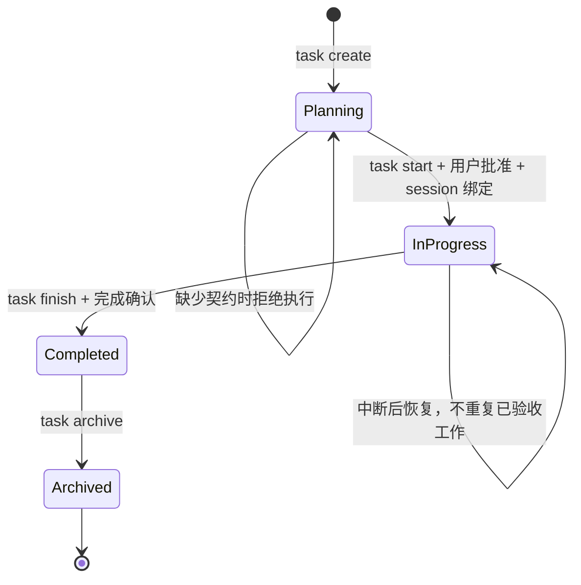

## 6. Hook 统一分发与信任边界

Codex 和 Claude 的原始 Hook 事件先归一化，再进入同一个 dispatcher。安装成功不等于 Hook 已受信任；系统分别报告 `installed`、`trusted` 和 `enforced`。

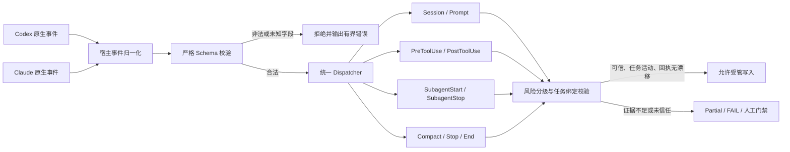

Hook 只记录有界元数据，不把原始工具响应、完整 transcript、final message 或私有推理写入公共状态。

## 7. Manager → Executor → Auditor 闭环

Executor 的“完成”声明不能直接成为可信进度。只有不同身份的 Auditor 在只读模式下确认工作区完整、证据对齐，Reducer 才能晋级 `verified_progress`。

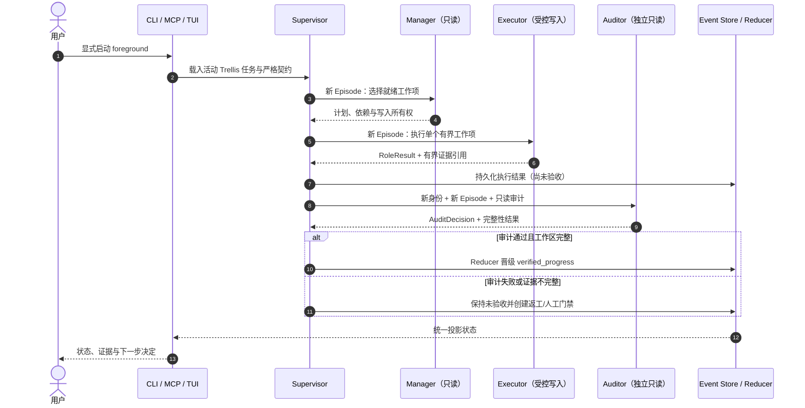

## 8. Managed Run 状态机

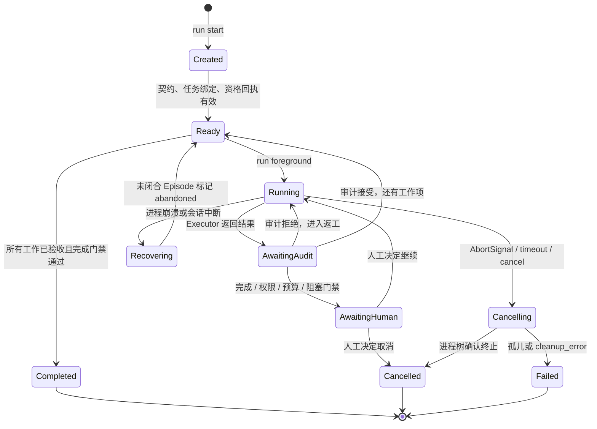

`status` 和 `resume` 只回放状态，不能隐式启动模型；只有 `run foreground` 和 MCP 的 `expert_team_run` 能创建宿主 Episode。

## 9. 事件持久化与恢复流程

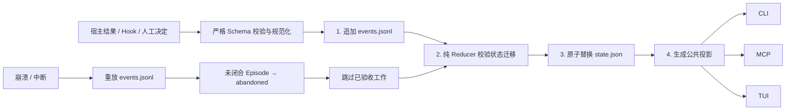

固定写入顺序是：**规范化事件 → `events.jsonl` → Reducer → 原子 `state.json` → 公共投影**。这避免“界面显示成功但事件没有落盘”的分叉状态。

## 10. 宿主进程、取消与清理

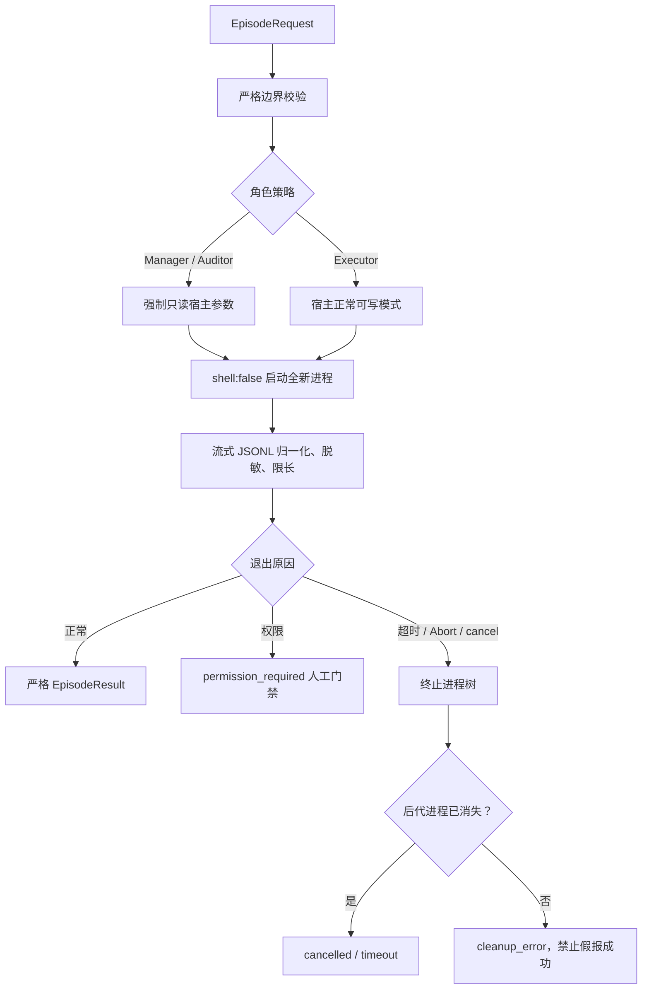

系统不会增加审批绕过、sandbox 绕过、Hook 信任绕过或 `danger-full-access` 参数。

## 11. CLI、MCP 与 TUI 的单一状态源

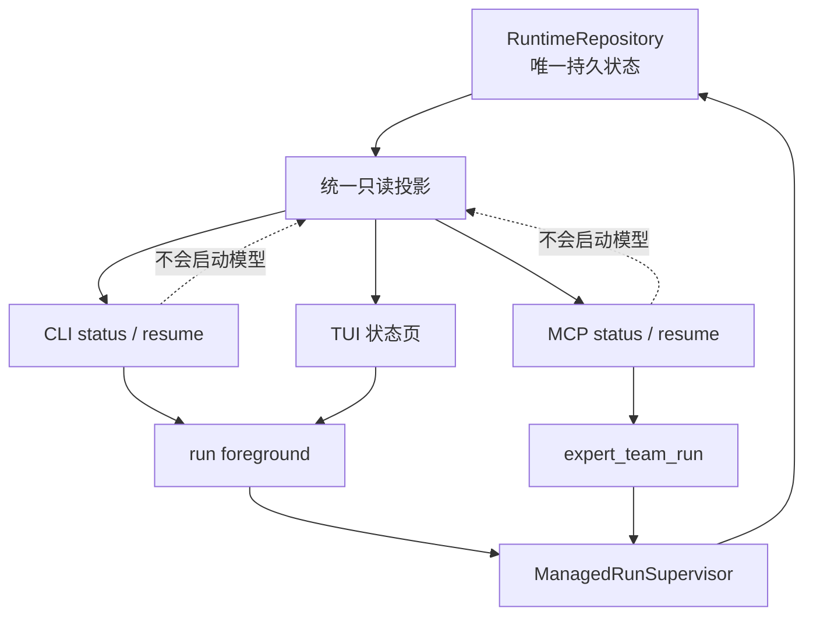

TUI 不拥有第二套数据库；离线更新检查失败也不会影响本地任务和运行状态。

## 12. CI 与发布门禁

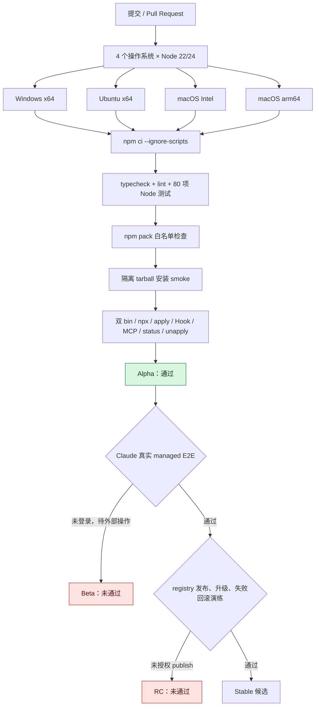

CI 每个矩阵单元执行同一套安装烟测，并在隔离 PATH 中验证 Python、Rust、Cargo 不可解析。npm 发布物只包含运行所需的 `bin/`、`dist/`、`schemas/mta/`、Skill、Agent、插件 manifest、MCP 入口、文档和许可证。

## 13. 已完成的验证证据

| 验证层级 | 结果 | 关键证据 |
|---|---:|---|
| TypeScript 类型与 lint | ✅ | Node 22/24、Windows/WSL 与远程矩阵通过 |
| Node 自动化测试 | ✅ | 80/80；Linux 的 Windows-only shim 按设计跳过 |
| Python 迁移对照 | ✅ | 105/105 migration-oracle 通过 |
| npm tarball | ✅ | 234 个发布文件；无运行时 `.py`、Cargo、Rust |
| 隔离安装 | ✅ | 两个命令别名、npx、双宿主 apply/status/hook/MCP/unapply |
| Apply/Unapply | ✅ | 幂等、并发漂移拒绝、中途回滚、用户修改保留 |
| Hook | ✅ | Codex/Claude 共用 dispatcher；Claude exec-form 直接启动已验证 |
| MCP | ✅ | 已安装包根与项目级 MCP initialize 均通过 |
| 运行时 | ✅ | fake-host 多轮、失败审计返工、恢复、门禁、取消竞争 |
| 进程清理 | ✅ | Windows PID tree 与 POSIX process group 路径覆盖 |
| Codex 真实模型 | ✅ | 真实 managed E2E 完成并验收 `evidence.txt = ALPHA` |
| 远程 CI | ✅ | 最新 `main@dedc88e` 的运行 31298502025 成功 |
| Claude 真实模型 | ⛔ | OAuth 过期；`loggedIn:false`、`authMethod:none` |
| npm registry 演练 | ⛔ | `npm view` 返回 E404；没有执行 publish |

证据原始记录：

- [`verification.md`](../archive/2026-08/08-09-verification-release/verification.md)
- [`cutover-report.json`](../archive/2026-08/08-09-verification-release/cutover-report.json)
- [`prd.md`](./prd.md)
- [`design.md`](./design.md)

## 14. 当前未完成项与关闭条件

### 14.1 Claude 真实 managed E2E

当前根因已经确认，不是流程猜测：Claude CLI 可启动，但 OAuth 会话过期，最终状态为未登录。

关闭条件：

1. 用户在 Claude Code 完成重新登录。
2. 运行一次真实 Manager → Executor → 独立 Auditor managed E2E。
3. 保存权限可见、审计独立、结果验收和无孤儿进程证据。
4. 将 `claudeRealManagedE2E` 更新为 `true`。

### 14.2 npm registry 发布与升级回滚

当前 registry 对包名返回 E404；这只能证明“未找到或当前账号无读取权限”，不能证明包名所有权，也不能自动授权发布。

关闭条件：

1. 用户明确授权发布 `0.5.0-alpha.0`。
2. 确认 npm 身份、包名权限和 dist-tag。
3. 发布 alpha，并从全新环境按精确版本安装。
4. 演练精确升级、安装失败自动回滚、回滚失败显式报错。
5. 将 RC registry gate 更新为 `true`。

在以上两项完成前：

- 不删除旧 Python 迁移对照实现。
- 不把 Beta、RC 或 Stable 标记为通过。
- 不把 fake-host 结果冒充真实 Claude 验收。

## 15. 标准操作流程

### 15.1 本地构建与核验

```bash
npm ci --ignore-scripts
npm run typecheck
npm run lint
npm test
npm run pack:check
npm run smoke:install
```

### 15.2 项目接管

```bash
mta apply --codex --claude
mta apply --codex --claude --yes
mta status --json
mta doctor --json
```

### 15.3 任务与运行

```bash
mta task create "任务标题" --slug task-slug
mta task start task-slug --session <session-id> --host codex
mta run start <run-id> --session <session-id> --contract '<json>' --workItems '<json>'
mta run foreground <run-id> --session <session-id> --host codex
mta run status <run-id> --session <session-id> --json
```

### 15.4 安全撤销

```bash
mta unapply
mta unapply --yes
```

第一次命令仅预览，第二次才提交。若检测到用户修改，MTA 保留对应字节并报告漂移。

## 16. 最终交付判定

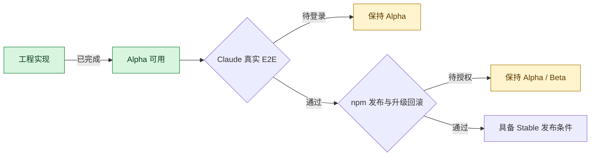

**最终判断：工程系统和内部流程已经搞定；完整正式发布流程尚差 Claude 登录验收与 npm 发布授权两道外部门禁。** 当前最准确的交付标签是 `0.5.0-alpha.0`，而不是 Stable。
