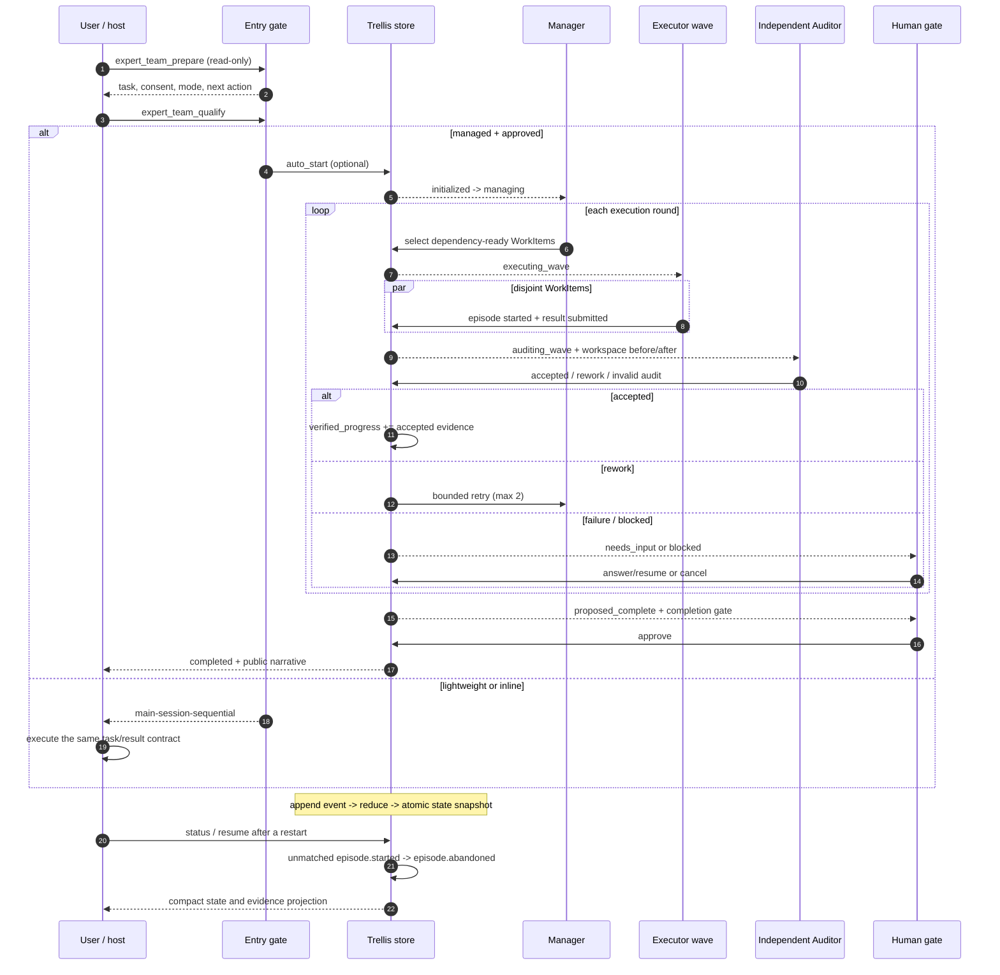
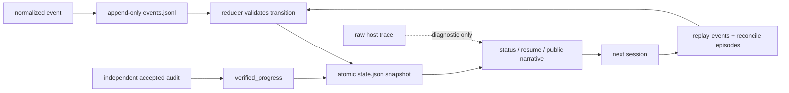
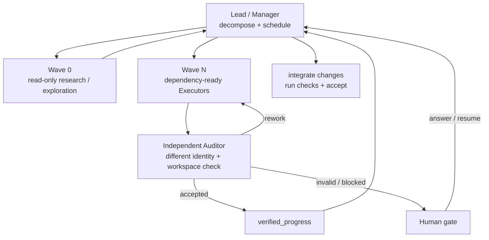

# Multi Teammates Agents

[English](README.md) · [简体中文](README_zh.md)

`multi-teammates-agents` is a Codex CLI and Claude Code plugin for coordinating
specialist agents. It supports lightweight native delegation and durable,
Trellis-backed managed runs with independent audit, resume, bounded retries,
and human completion gates.

The plugin does not copy Qoder code or require Qoder services. Codex and Claude
Code keep ownership of agent execution, permissions, concurrency, and native
inspection; the bundled local MCP server owns portable run state and evidence
acceptance.

## Capabilities

- Explicit `$expert-team` on Codex or
  `/multi-teammates-agents:expert-team` on Claude Code, plus conservative
  implicit activation.
- Dependency-aware task graphs and truthful state reporting.
- Six default roles: researcher, debug engineer, full-stack engineer, code
  reviewer, QA, and UI operator.
- Twenty separately defined ExpertTeam-Codex profiles across software, product,
  design, infrastructure, security, and database work.
- Lightweight `direct`, `fast`, `bugfix`, `standard`, and `audit` workflow
  routing with software, product, design, operations, security, and database
  lenses.
- Parallel read-only work and controlled disjoint write ownership.
- Sequential fallback when native subagents are unavailable.
- Optional project role overrides under `.expert-team/roles/`.
- Lightweight mode without Trellis runtime records.
- Managed mode with Trellis persistence, interruption recovery, leases,
  independent audit, compact resume context, and human gates.
- One normalized event contract for Codex and Claude host streams.

## Plugin structure

The repository root is the plugin root. Codex uses
`.codex-plugin/plugin.json`; Claude Code uses `.claude-plugin/plugin.json`.
Both load `skills/expert-team/`, the shared Python runtime, and the same
canonical role registry. Codex's manifest points at the bundled
`./.mcp.json`, while Claude auto-discovers that same root file; this keeps
the host package formats portable without duplicating the runtime. The bundled
MCP entry fixes its working directory to the installed plugin root and uses a
small Node launcher to select `python`/`py -3` on Windows and
`python3`/`python` on Ubuntu or other POSIX hosts. Claude also auto-discovers the
twenty generated definitions under `agents/`.

The repository also includes a Codex repo marketplace at
`.agents/plugins/marketplace.json`. It points back to the public `main` branch,
so the repository can be installed without copying files into `~/.codex`.

For Claude Code, `.claude-plugin/marketplace.json` exposes the same repository
as a Claude marketplace with a relative root plugin source.

No external account, hosted service, or graphical canvas is required.

## Use

Invoke the skill explicitly:

```text
$expert-team Investigate the performance regression, implement the fix, review
it for correctness, and verify the benchmark.
```

Add an optional routing hint when the domain should be explicit:

```text
$expert-team security Audit the authentication boundary and report evidence.
$expert-team ops Diagnose the deployment regression and propose a rollback-safe plan.
```

On Claude Code, invoke the namespaced skill:

```text
/multi-teammates-agents:expert-team Audit this migration with independent QA.
```

Codex may also activate the skill when a request has multiple independent
workstreams or materially different specialist perspectives. It should not
auto-trigger for simple questions or small mechanical edits.

Use `/agent` in Codex CLI or Claude Code's agent/context surfaces to inspect
native work. Subagents retain host permission behavior and consume additional
tokens. The plugin never injects permission- or sandbox-bypass flags.

### Delegation behavior

The skill applies [delegation guardrails](skills/expert-team/references/delegation-guardrails.md)
at every major wave. It uses direct handling for small, known work and proactively
dispatches bounded read-heavy, cross-file, parallel, or independent-review work
when that reduces lead-context pollution or adds verification value. Probe agents
return evidence with `file:line` anchors; the lead retains decisions, integration,
and final acceptance. These are project-level rules only: installing the plugin
does not edit `~/.codex/config.toml`, `~/.codex/AGENTS.md`, or user agent files.

## Execution modes

`lightweight` is the default for bounded work that fits one session. It uses
native agents and creates no managed-run directory.

### Mandatory entry handshake

Every explicit `$expert-team` invocation first calls the read-only
`expert_team_prepare` tool and then `expert_team_qualify`. The two responses
record the current Trellis task, consent requirement, execution tier, host
dispatch mode, and next legal action. Without these records the run must not
edit code or create managed state.

The server treats the mode as a policy decision, not an AI hint. An active
Trellis task, multiple dependency waves, durable audit, human gates, recovery,
or high-risk work locks the floor to `managed`; `explicit=lightweight` cannot
lower it. When both tiers are legal, the host must present one attributable
single-select choice through `expert_team_select_mode`; no response means
`needs_input`, never an implicit lightweight default. A claimed `actor=user`
without a host event is rejected.

`prepare` also returns `mode_options`, `selection_required`, `needs_input`, and
`selected_tier`. The two options are `Managed Expert Team (recommended)` and
`Lightweight Expert Team`; a policy-locked assessment disables the latter. If
the host cannot render a single-select control, the gate stays at
`needs_input` instead of letting the model choose.

`qualify` issues a workspace-bound receipt containing contract, graph, task
metadata, and workspace fingerprints. `expert_team_start` rejects missing,
stale, cross-workspace, or mismatched receipts; repeating the same task/run is
idempotent. Inline Codex may still use durable managed governance, but it is
reported as `main-session-sequential`, never as independent Auditor work.

Codex inline mode reports `main-session-sequential`; it must not be presented
as native delegation. If MCP or native subagents are unavailable, retain the
same task graph and result contract and label the run `sequential-fallback`.

After changing the plugin package, reinstall or refresh the installed plugin and
start a new host thread; an existing host session does not hot-load a new MCP
tool list.

If the MCP process starts from an installed cache without a trusted host
workspace, it fails closed with `workspace_unbound`; provide
`EXPERT_TEAM_WORKSPACE`, `CODEX_PROJECT_DIR`, or `CLAUDE_PROJECT_DIR` and open
a new session. Hook coverage is reported as `enforced`, `partial`, or
`advisory`; unsupported hosted tools are never described as fully blocked.

`managed` is selected explicitly or for cross-session, multi-wave,
evidence-heavy, or human-gated work. It requires an existing approved Trellis
task and uses this lifecycle:

### Long-task execution order

The following is the contract for a managed run. `prepare` is read-only;
`qualify` only creates a run when the caller has an approved task, a complete
`TaskContract`/`WorkItem` graph, and explicitly opts into `auto_start=true`.
`status` and `resume` inspect or recover a run; they do not silently start a
new model episode.



At every round, the Manager chooses only dependency-ready work. Executors may
run disjoint items in parallel, but an Executor result is still unverified
until a separate Auditor accepts evidence. An invalid result goes through the
bounded rework loop; a failure, permission issue, budget limit, cancellation,
or completion decision becomes a durable human gate rather than an implicit
retry.

### How long-task state follows across sessions

The state is followed by replayable facts, not by chat history or a best-effort
summary. The authoritative layers are:

| Layer | Durable source | What it means |
| --- | --- | --- |
| Trellis task | `.trellis/tasks/<task-id>/task.json` | Project lifecycle and approval (`planning`, `in_progress`, archive/finish). |
| Managed run snapshot | `.trellis/tasks/<task-id>/runs/<run-id>/state.json` | The current `RunState`, work-item statuses, round/budget counters, `pending_gate`, and `verified_progress`. |
| Event history | `events.jsonl` plus rounds/decisions logs in the run directory | Append-only normalized events; loading replays them and checks the snapshot. |
| Work-item evidence | `work-items/` and role-result records | Result, evidence, checks, risks, attempt, and ownership for one bounded item. |
| Host episodes | `episode.started` and terminal episode events | Process lifecycle. On restart, an unmatched start becomes `episode.abandoned`; it is never treated as accepted work. |
| Raw traces | `.trellis/workspace/<developer>/traces/<run-id>/` | Diagnostics only; they are not the public state or acceptance evidence. |

The update path is deliberately one-way:



Only an accepted independent audit can advance `verified_progress`; an
Executor's own claim, a raw trace, or a late result cannot promote work. A
cancelled run is terminal and ignores late Executor/Auditor decisions. A
`resume` reconstructs the compact snapshot, reconciles abandoned episodes, and
continues only from a legal state or returns the pending human gate.

### Subagent collaboration model

The lead owns decomposition, integration, and final acceptance. The managed
runtime uses dependency waves, while native subagents are only the execution
substrate:



| Role | Responsibility | Hard boundary |
| --- | --- | --- |
| Lead / Manager | Turn the request into a contract, dependency graph, waves, and final integration. | Does not self-certify an Executor result. |
| Researcher / explorer | Read-only search, diagnosis, or comparison; return `file:line` evidence. | No product writes and no acceptance decision. |
| Executor / worker | Complete one bounded objective under explicit file ownership and return structured evidence. | Cannot mark its own work accepted. |
| Independent Auditor / QA | Re-check the actual workspace and evidence with a different identity. | Read-only with respect to product changes; a dirty workspace makes the audit invalid. |
| Human gate | Resolve ask, blocked, repeated failure, budget, permission, cancellation, or completion decisions. | The run cannot skip a required gate by guessing. |

In Codex inline mode, the graph, state machine, result schema, and audit rules
still apply, but implementation and checking are reported as
`main-session-sequential`; the host must not claim native delegation that did
not happen. On a subagent-capable host, only independent, disjoint work is
parallelized; integration-sensitive writes and final checks stay with the
lead.

The bundled supervisor now owns this loop. `expert_team_run` launches a fresh
Codex or Claude CLI process for each role episode, streams normalized events,
enforces timeouts/cancellation, and pauses at durable human gates. The lower-level
`next`/`submit_result`/`submit_audit` tools are recovery/integration primitives,
not the normal interaction path.

Managed runs are terminal-first: the Codex/Claude MCP tool returns a readable
public narrative with each Manager decision, Executor summary, Auditor result,
and Trellis synchronization point. The local runner prints the same narrative
by default; use `--quiet` for the legacy snapshot JSON or `--json` for a compact
machine-readable projection. Raw host stdout, private reasoning, secrets, and
unredacted command metadata are never part of the narrative.

Qualification is side-effect-free by default. A caller that already has an
active Trellis task, run ID, TaskContract, and WorkItem graph may explicitly set
`auto_start=true` on the managed qualification call to create the durable run in
that same MCP operation; lightweight qualification never creates a run.

The bundled MCP surface mirrors the local lifecycle: `expert_team_qualify`
chooses a tier (and can atomically create a managed run when `auto_start=true`),
`expert_team_run` drives the automatic supervisor, and
`expert_team_status`/`expert_team_resume`/`expert_team_answer`/
`expert_team_cancel` expose inspection and human-gate control. The lower-level
`expert_team_start`, `expert_team_next`, result/audit submission, and host-event
tools remain available for recovery and integration; they are not required for
the normal managed path.

### Run the console locally

The local entry point can render an existing run without starting another model
episode. This is useful for reviewing a completed or gated run:

```powershell
python scripts/expert_team_run.py `
  --task-id <trellis-task-id> `
  --run-id <run-id>
```

Use the output mode that matches the caller:

```powershell
# Human-readable Manager / Executor / Auditor narrative (default)
python scripts/expert_team_run.py --task-id <task> --run-id <run>

# Backward-compatible snapshot JSON for existing scripts
python scripts/expert_team_run.py --task-id <task> --run-id <run> --quiet

# Compact public projection for automation
python scripts/expert_team_run.py --task-id <task> --run-id <run> --json
```

The same entry point exposes the complete lifecycle. `--start` creates durable
state only; it does not launch a model episode:

```powershell
# Create a run (the files contain a TaskContract and a WorkItem array)
python scripts/expert_team_run.py --task-id <task> --run-id <run> --start `
  --contract-file contract.json --work-items-file work-items.json

# Continue in the foreground (--run is an alias; no action keeps this legacy behavior)
python scripts/expert_team_run.py --task-id <task> --run-id <run> --foreground

# Inspect the full narrative or compact cross-session state
python scripts/expert_team_run.py --task-id <task> --run-id <run> --status
python scripts/expert_team_run.py --task-id <task> --run-id <run> --resume

# Record a human-gate decision; a JSON file avoids shell quoting problems
python scripts/expert_team_run.py --task-id <task> --run-id <run> --answer decision.json

# Cancel without deleting events, audits, or trace references
python scripts/expert_team_run.py --task-id <task> --run-id <run> --cancel --cancel-reason "user stopped"
```

These commands have the same lifecycle semantics as the Codex/Claude MCP
surface: `start`, `status`, `resume`, `answer`, and `cancel` operate on durable
Trellis state; only `foreground` launches fresh role episodes. `--json` and
`--quiet` can be combined with status actions. `resume` always emits compact
JSON without event details so another session can pick up safely.

The narrative is read-only. It projects validated Trellis events, role results,
audits, gates, and storage references; it never reads raw episode trajectories
for display.

Executor output is unverified until a different Auditor accepts real evidence.
Completion additionally requires all required items accepted and the human
completion gate approved.

If cancellation races with a running role episode, the run becomes terminal
without accepting a late Executor result or Auditor decision. A later resume
reconciles the unmatched episode start as `episode.abandoned`, so accepted work
is not repeated and unverified work is never promoted.

## Safe parallel writes

Research, diagnosis, review, and QA are read-only by default. Implementation
agents may write concurrently only when the lead assigns explicit, disjoint
files or modules. Overlapping and cross-cutting changes are sequenced, and the
lead owns integration and final verification.

The workflow chooses the lightest useful shape and does not invent a team for a
single-specialist task. A repeated failed gate is limited to two repair and
verification rounds before it is reported as blocked.

## Project-specific roles

Add Markdown definitions under `.expert-team/roles/` to override or extend the
default catalog. See
`skills/expert-team/references/expert-catalog.md` for the format. The plugin
never creates these files automatically.

## Bundled agent catalog

The complete catalog is indexed in
`skills/expert-team/references/agent-registry.md`. Every specialist has a
separate profile containing purpose, responsibilities, exclusions, evidence,
and handoff rules. Software, product, and design coordinator profiles are
applied by the current lead rather than spawned as nested team leads.

## Managed persistence

Managed state is stored under:

```text
.trellis/tasks/<task>/runs/<run-id>/
```

It includes an immutable initial state, atomic current snapshot, append-only
events, audits, work-item attempts, human decisions, and a final report slot.
Bulky host trajectories are separated under
`.trellis/workspace/<developer>/traces/<run-id>/`. Event replay is authoritative
and repairs a stale snapshot after an interrupted write.

Managed defaults can be customized by copying
`examples/expert-team-config.toml` to `.expert-team/config.toml`. Configuration
supports global and per-role host/model/timeouts/context budgets. Authentication
continues to come from Codex/Claude's active environment; persisted configuration
rejects keys, tokens, passwords, and secrets.
Values resolve in this order: explicit MCP/CLI overrides, project TOML,
environment variables, then built-in defaults. Per-role settings inherit the
global run values unless overridden.

Probe both installed host runtimes without starting a model episode:

```powershell
python scripts/expert_team_run.py --probe
```

## Trellis

The managed runtime writes only inside an approved task's `runs/` directory and
never changes Trellis task status, phase, approval, or archive state. Without
Trellis, lightweight mode remains available.

## Verification status

The deterministic contract, replay, supervisor, process-lifecycle, integrity,
configuration, and package checks pass locally, as do real host capability
probes and the repository CLI lifecycle. A Codex model-backed managed run has
also completed; Claude Code model-backed execution remains blocked by the local
organization/account model-access policy. Fake backends, fixture event streams,
and `--probe` are not substitutes for cross-host model-backed E2E evidence.
The active Trellis [verification report](.trellis/tasks/08-07-long-horizon-cross-cli-orchestration/check.md)
tracks the remaining parity, interruption, permission, and human-gate proof.

## Validate

```powershell
$codexHome = if ($env:CODEX_HOME) { $env:CODEX_HOME } else { Join-Path $env:USERPROFILE '.codex' }
python "$codexHome/skills/.system/plugin-creator/scripts/validate_plugin.py" .
python "$codexHome/skills/.system/skill-creator/scripts/quick_validate.py" skills/expert-team
python -m unittest discover -s tests -p "test_*.py"
python scripts/validate_contract.py tests/fixtures
python scripts/render_claude_agents.py --check
python -m mypy runtime scripts tests
claude plugin validate . --strict
```

## Installation

The commands below install the public plugin directly; an ordinary user does
not need to clone this repository or manually create an MCP entry. The plugin
is distributed as source: there is no `pip install` step and no
separate package registry. You need Git, Node.js 12+, Python 3.10+, and an
authenticated Codex CLI or Claude Code installation. The MCP launcher chooses
the platform's available Python command, so Ubuntu does not need a `python`
alias. The plugin bundles a TOML backport for Python 3.10, so copying
`.expert-team/config.toml` does not add a pip dependency. Lightweight mode works
without Trellis; managed mode additionally requires an approved, in-progress
Trellis task.

### Codex CLI

Install the public repository's bundled marketplace and then install the plugin:

```powershell
codex plugin marketplace add https://github.com/five-five0909/multi-teammates-agents.git --ref main --sparse .agents/plugins
codex plugin add multi-teammates-agents --marketplace multi-teammates-agents
codex plugin list --marketplace multi-teammates-agents
```

The bundled `expert-team` MCP server is registered by the enabled plugin; it is
not copied into `~/.codex/config.toml` and no manual MCP form is needed. Start
a new Codex session after installing or upgrading, then verify it with:

```powershell
codex mcp list
```

On Ubuntu, `codex mcp list` should show the plugin server even when only
`python3` exists. If it is missing, refresh the marketplace and reinstall the
plugin with the current Codex CLI; do not add a second manual server entry.

For Claude local development, clone the repository and load it directly:

```powershell
git clone https://github.com/five-five0909/multi-teammates-agents.git
cd multi-teammates-agents
claude --plugin-dir .
```

The checked-in Codex marketplace intentionally points at the public Git source,
so `codex plugin marketplace add .` still installs the published source rather
than uncommitted local files. For Codex local changes, run the MCP smoke command
from the checkout and use a temporary local marketplace configured by your Codex
installation; after pushing, refresh the public marketplace as shown above.

Update the marketplace before installing a newer revision:

```powershell
codex plugin marketplace upgrade multi-teammates-agents
```

### Claude Code

Load a local checkout for the current Claude Code session:

```powershell
git clone https://github.com/five-five0909/multi-teammates-agents.git
cd multi-teammates-agents
claude --plugin-dir .
```

Or load the public `main` branch as a ZIP for one session without cloning:

```powershell
claude --plugin-url https://github.com/five-five0909/multi-teammates-agents/archive/refs/heads/main.zip
```

`--plugin-dir` and `--plugin-url` are session-scoped. For a persistent Claude
Code installation, add this public marketplace and install the plugin:

```powershell
claude plugin marketplace add https://github.com/five-five0909/multi-teammates-agents.git#main
claude plugin install multi-teammates-agents@multi-teammates-agents --scope user
claude plugin list
```

Claude Code starts plugin MCP servers automatically when the plugin is enabled.
Reload the current session (or start a new one) and verify the connection with:

```powershell
claude mcp list
```

The entry is named `plugin:multi-teammates-agents:expert-team`. A project-level
`.mcp.json` entry with the same name may remain pending approval; that is a
separate project server, not the installed plugin server.

When developing from a checkout, run `claude plugin marketplace add ./` from the
repository root and use `--scope local` or `--scope project` as appropriate.

### Optional CC Switch manual MCP fallback (Windows / Ubuntu)

Normal plugin installation above configures MCP automatically. Use this
fallback only when a CC Switch-managed host cannot load bundled plugin MCP.
Do not copy a hard-coded drive letter, username, or Claude plugin cache path
from another machine. The repository includes a dependency-free generator that
locates its own checkout and emits a CC Switch entry with the correct local
launcher path. It works from a Git clone or an extracted ZIP.

Windows PowerShell:

```powershell
git clone https://github.com/five-five0909/multi-teammates-agents.git "$env:USERPROFILE\src\multi-teammates-agents"
Set-Location "$env:USERPROFILE\src\multi-teammates-agents"
node scripts/expert_team_ccswitch_config.js --json
node scripts/expert_team_ccswitch_config.js --server-json
node scripts/expert_team_ccswitch_config.js --deeplink --apps claude
```

Ubuntu (including a native Ubuntu install):

```bash
git clone https://github.com/five-five0909/multi-teammates-agents.git "$HOME/src/multi-teammates-agents"
cd "$HOME/src/multi-teammates-agents"
node scripts/expert_team_ccswitch_config.js --json
node scripts/expert_team_ccswitch_config.js --server-json
node scripts/expert_team_ccswitch_config.js --deeplink --apps claude
```

For WSL, run the generator inside WSL and use the Linux path visible to WSL;
do not paste a Windows `C:\...` path into a Linux CC Switch/CLI process. The
`--server-json` output can be copied into the custom stdio form (server ID
`expert-team`, using the generated `command` and `args` values). `--json` keeps
the full `mcpServers` wrapper for a config file, while
`--deeplink` prints a one-click `ccswitch://` import link. The generator records
the Node executable used on the current machine so GUI-launched CC Switch does
not depend on an incomplete shell `PATH`. The default `--apps claude` avoids
changing Codex; add `--apps claude,codex` only when Codex synchronization is
explicitly wanted.

The generated server launches
`scripts/expert_team_mcp_launcher.js` directly, so no `PLUGIN_ROOT` value or
shell-specific quoting is needed. The launcher selects `python`/`py -3` on
Windows and `python3`/`python` on Ubuntu. Restart the target CLI after CC Switch
synchronizes the entry and verify with `claude mcp list` or `codex mcp list`.
The generated JSON/link is intentionally local to the machine where it was
created; after moving the checkout to another machine, rerun the generator
there instead of reusing the old absolute path.
Do not enable a second manually-added `expert-team` entry while the installed
plugin's own `expert-team` server is already active.

### Verify and remove

After installation, verify both host probes and the plugin contract:

```powershell
python scripts/expert_team_run.py --probe
claude plugin validate . --strict
```

Remove a Codex installation with:

```powershell
codex plugin remove multi-teammates-agents --marketplace multi-teammates-agents
codex plugin marketplace remove multi-teammates-agents
```

Remove a persistent Claude Code installation with:

```powershell
claude plugin uninstall multi-teammates-agents
```

Removing the plugin does not delete user-owned `.expert-team/runs/` audit
artifacts.

## Qoder-to-Codex mapping

| Qoder Experts behavior | Codex implementation |
|---|---|
| Lead plus specialist experts | Lead Codex thread plus native subagents |
| Parallel expert work | Native Codex subagent concurrency |
| Expert task list and status | Lead task ledger plus `/agent` |
| Built-in experts | Bundled portable role catalog |
| Custom subagents | Project role overrides |
| Expert synchronization | Native wait/result collection |
| Experts Canvas | Out of scope; native threads remain inspectable |

The managed lifecycle is being developed from portable concepts in the MIT-licensed
[LongHorizon-Harness](https://github.com/AMAP-ML/LongHorizon-Harness): separated
Manager/Executor/Auditor roles, independently verified progress, bounded rounds,
resume, and human gates. The current implementation includes durable state, MCP
control, real CLI episode runners, the continuous supervisor, and protected
Auditor execution. Deterministic fake-process/fake-backend integration passes;
model-backed cross-host E2E validation is still tracked by the active Trellis
task and must not be treated as complete.
Upstream privileged launcher defaults and bypass flags are deliberately not used.

The routing and safety guidance also incorporates portable lessons from the
MIT-licensed [ExpertTeam-Codex](https://github.com/ReJeCtAll/ExpertTeam-Codex)
project. Its domain routing and bounded quality loops were adapted to current
Codex-native subagents; its direct `~/.codex` installer, older agent/command
formats, and team-runtime assumptions were not copied.

## License

MIT. See `LICENSE`.
