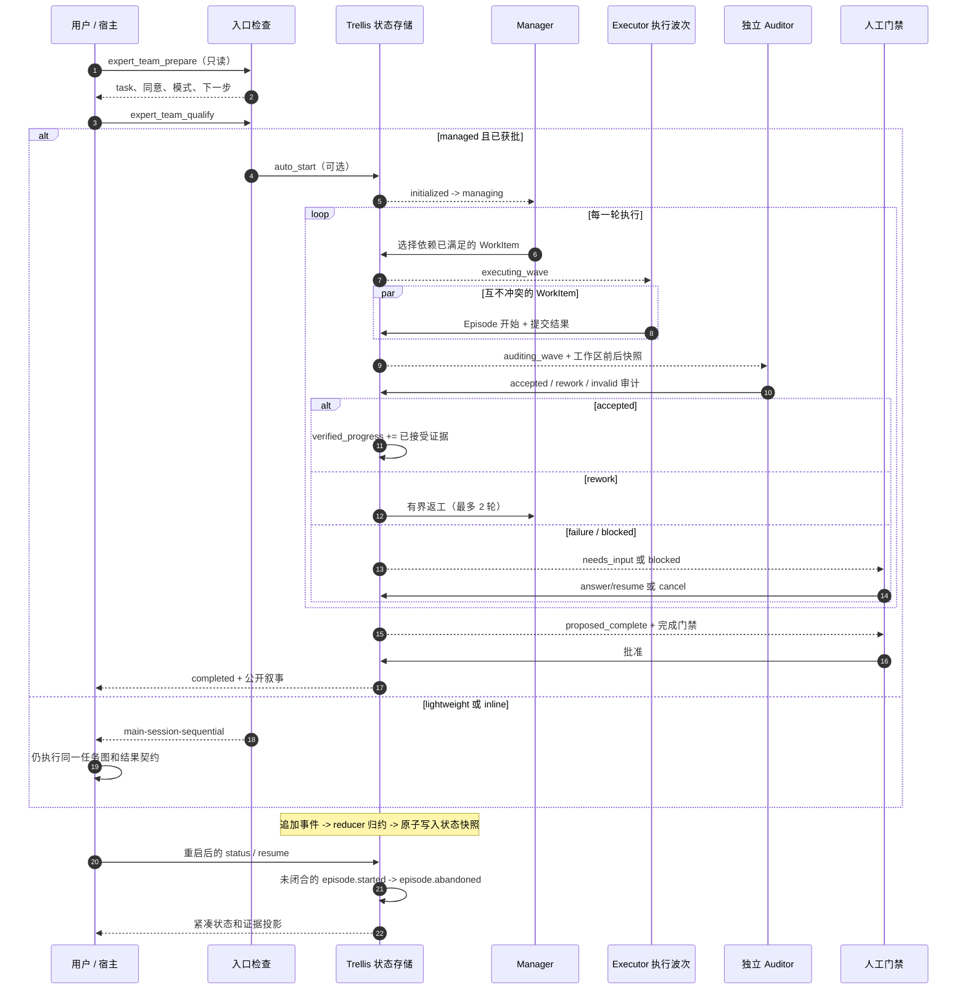
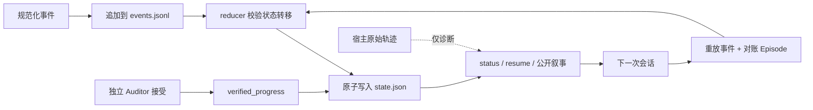
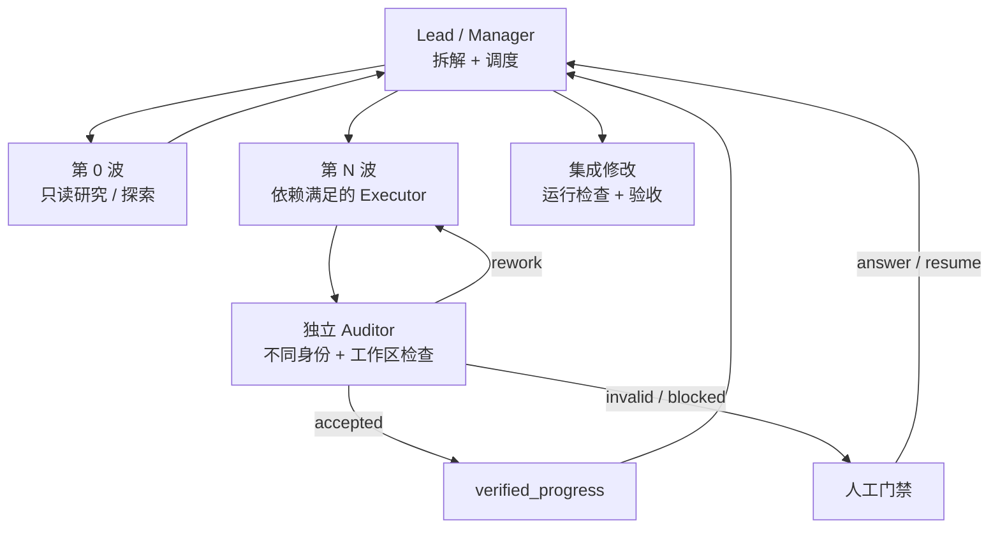

# Multi Teammates Agents

[English](README.md) · [简体中文](README_zh.md)

`multi-teammates-agents` 是一个适配 Codex CLI 和 Claude Code 的专家团插件，
用于协调多个专业 Agent。它同时支持轻量级的原生委派，以及由 Trellis 持久化
管理的长任务模式，提供独立审计、任务恢复、有限重试和人工完成门禁。

本项目不复制 Qoder 的代码，也不依赖 Qoder 服务。Codex 和 Claude Code 仍然
负责 Agent 的执行、权限、并发和原生代码检查；项目内置的本地 MCP 服务负责
可移植的运行状态和证据验收。

## 功能概览

- 在 Codex 中使用 `$expert-team`，或在 Claude Code 中使用
  `/multi-teammates-agents:expert-team`，也支持保守的隐式激活。
- 支持依赖关系图和真实状态报告。
- 六个默认角色：研究员、调试工程师、全栈工程师、代码审查员、QA 和 UI 操作员。
- 二十个独立定义的 ExpertTeam-Codex 专家档案，覆盖软件、产品、设计、基础设施、
  安全和数据库工作。
- 支持 `direct`、`fast`、`bugfix`、`standard`、`audit` 五种轻量工作流，以及软件、
  产品、设计、运维、安全和数据库领域视角。
- 支持并行只读工作，以及受控的、互不冲突的写入范围。
- 原生子 Agent 不可用时自动退化为串行执行。
- 支持通过 `.expert-team/roles/` 添加项目级角色覆盖。
- 轻量模式不写入 Trellis 运行记录。
- 管理模式提供 Trellis 持久化、中断恢复、租约、独立审计、紧凑恢复上下文和人工门禁。
- Codex 与 Claude 的主机事件使用同一套规范化事件契约。

## 插件结构

仓库根目录就是插件根目录：

- Codex 使用 `.codex-plugin/plugin.json`；
- Claude Code 使用 `.claude-plugin/plugin.json`；
- 两者共同加载 `skills/expert-team/`、共享 Python 运行时和统一的专家注册表。Codex
  的 manifest 指向根目录 `./.mcp.json`，Claude 也从同一个根目录文件自动发现 MCP；
  内置 MCP 固定从安装后的插件根目录启动，并使用一个很小的 Node 启动桥：
  Windows 优先选择 `python`/`py -3`，Ubuntu 和其他 POSIX 系统优先选择
  `python3`/`python`，因此不依赖 Ubuntu 的 `python` 别名；
- Claude Code 还会自动发现 `agents/` 下生成的二十个 Agent 定义。

仓库还包含 Codex 的仓库级 marketplace：`.agents/plugins/marketplace.json`。它指向
公开仓库的 `main` 分支，因此不需要把文件复制到 `~/.codex` 就能安装。

对于 Claude Code，`.claude-plugin/marketplace.json` 也提供了同一个仓库级 marketplace，
并使用仓库根目录作为插件源。

不需要外部账户、托管服务或图形化画布即可运行。

## 使用方式

显式调用专家团技能：

```text
$expert-team 调查这个性能回归，实施修复，审查正确性，并验证基准结果。
```

需要明确领域时，可以添加路由提示：

```text
$expert-team security 审计认证边界并报告证据。
$expert-team ops 诊断部署回归并提出可安全回滚的方案。
```

在 Claude Code 中使用带命名空间的技能：

```text
/multi-teammates-agents:expert-team 对这次迁移进行独立 QA 审计。
```

当请求包含多个独立工作流或需要不同专家视角时，Codex 也可以自动激活该技能。
简单问答或机械性小修改不会自动触发专家团。

可以使用 Codex CLI 的 `/agent` 或 Claude Code 的 Agent/上下文界面查看原生工作。
子 Agent 保持宿主平台的权限行为，并会消耗额外 token。插件不会注入权限绕过或沙箱
绕过参数。

### 子代理委派行为

技能会在每一大轮任务前后应用[子代理委派规则](skills/expert-team/references/delegation-guardrails.md)：
小范围、已知位置的内容由主代理直接处理；宽读取、跨文件检索、并行探索或独立审查，
只有在能减少主线程污染或增加核验价值时才派发。探子必须返回带 `file:line` 的证据，
主代理保留方案取舍、写入集成和最终验收权。这些只是项目内规则，安装插件不会修改
`~/.codex/config.toml`、`~/.codex/AGENTS.md` 或用户的 Agent 文件。

## 执行模式

`lightweight` 是适合单次会话、有明确边界任务的默认模式。它使用宿主平台的原生
Agent，不创建 managed run 目录。

### 强制入口检查

每次显式调用 `$expert-team` 都必须先经过只读的
`expert_team_prepare`，再调用 `expert_team_qualify`。入口检查会报告当前
Trellis task、是否需要立项同意、执行层级和下一步动作；没有这两份证据，不能
开始改代码或创建 managed run。

Codex inline 模式会明确报告 `main-session-sequential`，表示实现和检查由主会话
顺序完成，不能把它伪装成已经派发了原生 Agent。宿主不支持 MCP 时也必须保留同一
任务图和结果契约，并明确标记 `sequential-fallback`。

如果宿主已经安装了旧版本插件，必须重新安装/刷新插件并开启新会话，宿主才会重新
加载新增的 MCP 工具；当前会话不会热加载工具清单。

对于跨会话、多轮次、证据密集型或需要人工门禁的任务，可以显式选择 `managed`：

### 长任务执行顺序

下面这张图就是 managed run 的执行契约。`prepare` 只读；只有调用方已有获批的
Trellis task、完整的 `TaskContract`/`WorkItem` 任务图，并且明确传
`auto_start=true` 时，`qualify` 才会创建运行。`status` 和 `resume` 只查看或恢复，
不会悄悄启动新的模型 Episode。



每一轮都只调度依赖满足的工作项。Executor 可以并行处理互不冲突的工作项，但
Executor 的结果必须经过不同身份的 Auditor 接受证据后，才算已验证。无效结果进入
有界返工；失败、权限、预算、取消或完成判断都会形成持久化人工门禁，不会被隐式重试。

### 长任务状态如何跨会话跟随

状态跟随依靠可重放的事实，不依靠聊天记录或“差不多的摘要”。权威层次如下：

| 层次 | 持久化来源 | 含义 |
| --- | --- | --- |
| Trellis task | `.trellis/tasks/<task-id>/task.json` | 项目生命周期和立项状态（`planning`、`in_progress`、归档/完成）。 |
| Managed run 快照 | `.trellis/tasks/<task-id>/runs/<run-id>/state.json` | 当前 `RunState`、工作项状态、轮次/预算计数、`pending_gate` 和 `verified_progress`。 |
| 事件历史 | run 目录里的 `events.jsonl` 以及 rounds/decisions 日志 | 只追加的规范化事件；加载时会重放并校验快照。 |
| 工作项证据 | `work-items/` 和角色结果记录 | 一个有边界工作项的结果、证据、检查、风险、尝试次数和所有权。 |
| 宿主 Episode | `episode.started` 与 Episode 终态事件 | 进程生命周期。重启时未闭合的开始事件会变成 `episode.abandoned`，绝不会被当成已接受工作。 |
| 原始轨迹 | `.trellis/workspace/<developer>/traces/<run-id>/` | 只用于诊断，不是公开状态，也不是验收证据。 |

更新路径是单向且可审计的：



只有独立 Auditor 的 `accepted` 审计可以推进 `verified_progress`；Executor 自己的
声明、原始轨迹或迟到结果都不能把工作提升为已验证。取消后的 run 是终态，迟到的
Executor/Auditor 决定会被忽略。`resume` 会重建紧凑快照、对账 abandoned Episode，
然后只从合法状态继续，或返回待处理的人工门禁。

### Subagents / 子代理协作模型

Lead 负责拆解、集成和最终验收。managed runtime 负责依赖波次，原生 subagents 只是
执行载体：



| 角色 | 负责什么 | 硬边界 |
| --- | --- | --- |
| Lead / Manager | 把需求变成契约、依赖图、执行波次，并负责最终集成。 | 不能自己给 Executor 结果盖“已验收”章。 |
| Researcher / explorer | 只读检索、诊断、对比，返回带 `file:line` 的证据。 | 不写产品代码，也不做验收决定。 |
| Executor / worker | 在明确的文件所有权和单一目标内完成工作，返回结构化证据。 | 不能把自己的结果标记为 accepted。 |
| Independent Auditor / QA | 用不同身份复核真实工作区和证据。 | 对产品改动保持只读；工作区不干净时审计无效。 |
| Human gate | 处理 ask、blocked、重复失败、预算、权限、取消和完成判断。 | 不能靠猜测跳过必需门禁。 |

在 Codex inline 模式下，任务图、状态机、结果 schema 和审计规则仍然生效，但实现和
检查必须报告为 `main-session-sequential`；没有发生原生派发就不能声称已经委派。在
支持 subagents 的宿主上，也只并行处理互相独立且文件不冲突的工作；集成敏感的写入
和最终检查仍由 Lead 顺序完成。

内置 Supervisor 负责完整闭环。`expert_team_run` 会为每个角色启动全新的 Codex 或
Claude CLI 进程，收集规范化事件，执行超时/取消控制，并在人工门禁处暂停。
底层的 `next`、`submit_result`、`submit_audit` 工具只用于恢复或集成，不是正常的
日常交互路径。

Executor 的结果在独立 Auditor 接受真实证据前都不会被视为已验证。任务完成还要求
所有必需工作项通过审计，并且人工完成门禁获得批准。

如果取消操作与正在运行的角色 Episode 发生竞争，运行会立即进入终止状态，不会再接受
迟到的 Executor 结果或 Auditor 决定。之后恢复运行时，系统会把没有终态的 Episode 起始
事件标记为 `episode.abandoned`，因此已接受的工作不会重复，未验证结果也不会被提升。

MCP 的资格判定默认不写入状态；如果调用方已经准备好活动 Trellis task、run ID、
TaskContract 和 WorkItem 图，可以显式传 `auto_start=true`，在同一次 managed 资格
调用中创建持久化运行。轻量级请求永远不会因为资格判定创建运行目录。

内置 MCP 接口与本地生命周期保持一致：`expert_team_qualify` 负责选择模式（显式
`auto_start=true` 时还可以原子创建 managed run），`expert_team_run` 驱动自动
Supervisor，`expert_team_status`、`expert_team_resume`、`expert_team_answer`、
`expert_team_cancel` 负责查看状态和处理人工门禁。较底层的
`expert_team_start`、`expert_team_next`、结果/审计提交和宿主事件接口仍可用于恢复与
集成，但正常的 managed 流程不需要手动调用它们。

## 命令行叙事控制台

管理模式优先采用命令行输出。Codex/Claude 的 MCP 工具会返回一份公开叙事，包含每轮
Manager 决策、Executor 摘要、Auditor 结果和 Trellis 同步点。本地脚本默认输出相同
叙事；自动化调用可以选择旧 JSON 或紧凑 JSON。

本地入口可以直接查看已有运行记录，不会因此重新启动模型 Episode：

```powershell
python scripts/expert_team_run.py `
  --task-id <trellis-task-id> `
  --run-id <run-id>
```

三种输出模式：

```powershell
# 默认：适合人阅读的 Manager / Executor / Auditor 叙事
python scripts/expert_team_run.py --task-id <task> --run-id <run>

# 兼容旧脚本：输出原来的快照 JSON
python scripts/expert_team_run.py --task-id <task> --run-id <run> --quiet

# 自动化：输出紧凑的公开结构化投影
python scripts/expert_team_run.py --task-id <task> --run-id <run> --json
```

同一个入口也提供完整生命周期操作；`--start` 只创建持久化运行，不会立刻消耗模型调用：

```powershell
# 创建运行（两个文件分别是 TaskContract JSON 和 WorkItem 数组 JSON）
python scripts/expert_team_run.py --task-id <task> --run-id <run> --start `
  --contract-file contract.json --work-items-file work-items.json

# 前台继续执行（--run 是同义写法；不写动作时也保持这个旧行为）
python scripts/expert_team_run.py --task-id <task> --run-id <run> --foreground

# 查看完整叙事、跨会话紧凑状态
python scripts/expert_team_run.py --task-id <task> --run-id <run> --status
python scripts/expert_team_run.py --task-id <task> --run-id <run> --resume

# 记录人工门禁决定；推荐传 JSON 文件，避免 shell 转义问题
python scripts/expert_team_run.py --task-id <task> --run-id <run> --answer decision.json

# 取消运行但保留事件、审计和轨迹引用
python scripts/expert_team_run.py --task-id <task> --run-id <run> --cancel --cancel-reason "用户停止"
```

这些命令与 Codex/Claude 的 MCP 生命周期语义相同：`start`、`status`、`resume`、
`answer`、`cancel` 都只操作 Trellis 持久化状态，`foreground` 才会启动新的角色
Episode。`--json` 和 `--quiet` 仍可与状态输出动作组合；`resume` 固定输出不含事件明细
的紧凑 JSON，方便下一次会话接续。

叙事渲染是只读的，只投影经过验证的 Trellis 事件、角色结果、审计、门禁和存储引用。
它不会为了展示而读取原始 Episode 轨迹，也不会输出宿主 stdout、私有思维链、密钥或
未脱敏的命令元数据。

## 安全的并行写入

研究、诊断、审查和 QA 默认是只读的。实现 Agent 只有在负责人分配了明确且互不冲突
的文件或模块时，才可以并行写入。跨范围或重叠修改会被串行化，负责人负责集成和
最终验证。

工作流会选择满足任务所需的最小形态，不会为单个专家任务强行创建团队。重复失败的
门禁最多进行两轮修复和验证，之后报告为 blocked。

## 项目级角色

可以在 `.expert-team/roles/` 下添加 Markdown 定义，用于覆盖或扩展默认角色目录。
格式见 `skills/expert-team/references/expert-catalog.md`。插件不会自动创建这些文件。

## 内置专家目录

完整目录索引位于 `skills/expert-team/references/agent-registry.md`。每个专家都有独立
档案，包含用途、职责、排除范围、证据要求和交接规则。软件、产品和设计协调角色由
当前负责人直接应用，不会被作为嵌套负责人再次派发。

## 管理模式持久化

管理模式状态存储在：

```text
.trellis/tasks/<task>/runs/<run-id>/
```

其中包含不可变初始状态、原子化当前快照、追加式事件、审计记录、工作项尝试、人工
决策和最终报告槽位。体积较大的宿主轨迹单独存放在：

```text
.trellis/workspace/<developer>/traces/<run-id>/
```

事件回放是权威来源；如果中断导致快照过期，系统会根据事件日志修复快照。

可以复制 `examples/expert-team-config.toml` 到 `.expert-team/config.toml` 来定制管理
模式默认值。配置支持全局和按角色设置宿主、模型、超时以及上下文预算。认证仍由
Codex/Claude 当前环境负责，持久化配置会拒绝 key、token、password 和 secret 字段。
配置优先级依次为：显式 MCP/CLI 覆盖、项目 TOML、环境变量、内置默认值。按角色配置
默认继承全局运行配置，只有显式设置的字段会覆盖它。

在不启动模型 Episode 的情况下检查两个宿主运行时：

```powershell
python scripts/expert_team_run.py --probe
```

## Trellis 约束

管理运行时只会写入已批准任务的 `runs/` 目录，不会修改 Trellis 任务的状态、阶段、
审批或归档状态。没有 Trellis 时，轻量模式仍然可用。

## 验证状态

当前本地的契约、回放、Supervisor、进程生命周期、完整性、配置和插件打包检查均已通过，
宿主能力探针和仓库 CLI 生命周期也已通过。Codex 已完成一次模型驱动的 managed 运行；
Claude Code 的模型驱动运行仍受本机组织/账号模型访问策略限制。fake backend、fixture
事件流和 `--probe` 都不能替代跨宿主的模型 E2E 证据。剩余的跨宿主一致性、中断恢复、权限
和人工门禁证据记录在活动 Trellis 的[验证报告](.trellis/tasks/08-07-long-horizon-cross-cli-orchestration/check.md)中。

## 校验

```powershell
$codexHome = if ($env:CODEX_HOME) { $env:CODEX_HOME } else { Join-Path $env:USERPROFILE '.codex' }
python "$codexHome/skills/.system/plugin-creator/scripts/validate_plugin.py" .
python "$codexHome/skills/.system/skill-creator/scripts/quick_validate.py" skills/expert-team
python -m unittest discover -s tests -p "test_*.py"
python scripts/validate_contract.py tests/fixtures
python scripts/render_claude_agents.py --check
python -m mypy runtime scripts tests
claude plugin validate . --strict
```

## 安装

下面的命令会直接安装公开插件，普通用户不需要克隆仓库，也不需要手动填写 MCP。插件以
源码形式分发：不需要执行 `pip install`，也没有额外的包仓库。你需要安装
Git、Node.js 12+、Python 3.10+，并完成 Codex CLI 或 Claude Code 的登录。MCP 启动桥会
自动选择当前系统可用的 Python 命令；Ubuntu 不需要额外创建 `python` 别名。插件还内置
了 Python 3.10 可用的 TOML 解析兼容层，复制 `.expert-team/config.toml` 不会额外要求
执行 pip 安装。轻量模式不依赖 Trellis；管理模式还要求存在一个已批准且处于
`in_progress` 的 Trellis 任务。

### Codex CLI

先添加仓库自带的公开 marketplace，再安装插件：

```powershell
codex plugin marketplace add https://github.com/five-five0909/multi-teammates-agents.git --ref main --sparse .agents/plugins
codex plugin add multi-teammates-agents --marketplace multi-teammates-agents
codex plugin list --marketplace multi-teammates-agents
```

内置的 `expert-team` MCP 会由已启用的插件自动注册，不会复制到
`~/.codex/config.toml`，也不需要手动添加同名服务器。安装或升级后要重新打开 Codex
会话，然后检查：

```powershell
codex mcp list
```

Ubuntu 即使只有 `python3` 也应该能看到插件 MCP。如果看不到，先用当前 Codex CLI
刷新 marketplace 并重新安装插件，不要立即手动添加第二份同名服务器。

Claude 本地开发时，可以克隆仓库并直接加载当前目录：

```powershell
git clone https://github.com/five-five0909/multi-teammates-agents.git
cd multi-teammates-agents
claude --plugin-dir .
```

仓库内置的 Codex marketplace 刻意指向公开 Git 源，因此执行
`codex plugin marketplace add .` 仍会安装公开源，而不是未提交的本地文件。要在
Codex 中测试未提交改动，请先在 checkout 中运行 MCP 冒烟检查，再使用 Codex 自己的
临时本地 marketplace；提交并推送后按上面的公开 marketplace 流程刷新即可。

要安装更新后的版本，先刷新 marketplace：

```powershell
codex plugin marketplace upgrade multi-teammates-agents
```

### Claude Code

在当前 Claude Code 会话中加载本地仓库：

```powershell
git clone https://github.com/five-five0909/multi-teammates-agents.git
cd multi-teammates-agents
claude --plugin-dir .
```

也可以不克隆仓库，直接把公开 `main` 分支作为 ZIP 加载到当前会话：

```powershell
claude --plugin-url https://github.com/five-five0909/multi-teammates-agents/archive/refs/heads/main.zip
```

`--plugin-dir` 和 `--plugin-url` 都只对当前会话生效。要持久安装到 Claude Code，
可以添加公开 marketplace 并安装插件：

```powershell
claude plugin marketplace add https://github.com/five-five0909/multi-teammates-agents.git#main
claude plugin install multi-teammates-agents@multi-teammates-agents --scope user
claude plugin list
```

Claude Code 会在插件启用时自动启动插件 MCP。重新加载当前会话（或新开会话）后检查：

```powershell
claude mcp list
```

列表中的名称应为 `plugin:multi-teammates-agents:expert-team`。如果项目根目录的
`.mcp.json` 里还有同名的待批准项目服务器，那是项目级配置，不是已安装插件的 MCP。

从本地 checkout 开发时，在仓库根目录执行 `claude plugin marketplace add ./`，再按需
使用 `--scope local` 或 `--scope project`。

### 可选：CC Switch 手动 MCP 兜底（Windows / Ubuntu）

上面的插件安装已经会自动配置 MCP。只有 CC Switch 管理的宿主无法读取插件自带 MCP 时，
才使用下面的兜底方案。不要把某台机器的盘符、用户名或 Claude 插件缓存路径复制给别人。
仓库自带一个无第三方依赖的生成器：它会从当前下载目录自动定位插件根目录，并生成当前机器可用的 CC Switch
配置。Git clone 和解压 ZIP 都可以使用。

Windows PowerShell：

```powershell
git clone https://github.com/five-five0909/multi-teammates-agents.git "$env:USERPROFILE\src\multi-teammates-agents"
Set-Location "$env:USERPROFILE\src\multi-teammates-agents"
node scripts/expert_team_ccswitch_config.js --json
node scripts/expert_team_ccswitch_config.js --server-json
node scripts/expert_team_ccswitch_config.js --deeplink --apps claude
```

Ubuntu（包括原生 Ubuntu）：

```bash
git clone https://github.com/five-five0909/multi-teammates-agents.git "$HOME/src/multi-teammates-agents"
cd "$HOME/src/multi-teammates-agents"
node scripts/expert_team_ccswitch_config.js --json
node scripts/expert_team_ccswitch_config.js --server-json
node scripts/expert_team_ccswitch_config.js --deeplink --apps claude
```

如果使用 WSL，必须在 WSL 内运行生成器，并使用 WSL 能看到的 Linux 路径；不要把 Windows
的 `C:\...` 路径粘到 Linux 的 CC Switch/CLI 进程里。`--json` 输出可以粘贴到 CC Switch
的自定义 stdio 表单（服务器 ID 填 `expert-team`，使用生成的 `command` 和 `args`）。
`--json` 保留完整的 `mcpServers` 外层结构；`--deeplink` 会输出一个可以直接交给
CC Switch 导入的 `ccswitch://` 链接。JSON 中的
`command` 是生成器当前机器上的真实 Node 可执行文件，因此 GUI 启动 CC Switch 时不依赖
不完整的 shell `PATH`。默认的 `--apps claude` 不会同步 Codex；只有明确需要时才使用
`--apps claude,codex`。

生成的服务器会直接启动 `scripts/expert_team_mcp_launcher.js`，不再需要填写
`PLUGIN_ROOT`，也不依赖 shell 的引号规则。启动桥会在 Windows 依次尝试
`python`、`py -3`、`python3`，在 Ubuntu 依次尝试 `python3`、`python`。CC Switch 同步后
重启 Claude/Codex，再用 `claude mcp list` 或 `codex mcp list` 检查。若已启用插件自动提供
的同名 `expert-team`，不要再开启第二条同名手动服务器。生成的 JSON/链接故意只针对生成
它的这台机器；把仓库移到另一台机器后，应在新机器重新运行生成器，不要继续复用旧的绝对路径。

### 验证与移除

安装后，执行宿主探针和插件校验：

```powershell
python scripts/expert_team_run.py --probe
claude plugin validate . --strict
```

移除 Codex 安装：

```powershell
codex plugin remove multi-teammates-agents --marketplace multi-teammates-agents
codex plugin marketplace remove multi-teammates-agents
```

移除持久化的 Claude Code 安装：

```powershell
claude plugin uninstall multi-teammates-agents
```

移除插件不会删除用户自行创建的 `.expert-team/runs/` 审计文件。

## Qoder 到 Codex 的映射

| Qoder 专家团能力 | Codex 实现 |
|---|---|
| Lead 加多个专家 | Lead Codex 线程 + 原生子 Agent |
| 并行专家工作 | Codex 原生子 Agent 并发 |
| 专家任务列表和状态 | Lead 任务账本 + `/agent` |
| 内置专家 | 内置可移植角色目录 |
| 自定义子 Agent | 项目级角色覆盖 |
| 专家同步 | 原生等待与结果收集 |
| Experts Canvas | 暂不实现；继续使用可检查的原生线程 |

管理模式的生命周期借鉴了 MIT 许可的
[LongHorizon-Harness](https://github.com/AMAP-ML/LongHorizon-Harness) 中可移植的
设计：Manager/Executor/Auditor 分离、独立验证进度、有限轮次、恢复和人工门禁。
当前实现已经包含持久化状态、MCP 控制、真实 CLI Episode Runner、连续 Supervisor
以及受保护的 Auditor 执行。确定性的 fake-process/fake-backend 集成已通过；跨宿主的
模型 E2E 仍由活动 Trellis 任务跟踪，不能提前宣称全部完成。

上游特权启动器默认值和绕过参数没有被引入。

路由和安全规则也吸收了 MIT 许可的
[ExpertTeam-Codex](https://github.com/ReJeCtAll/ExpertTeam-Codex) 中可移植的经验。
项目只适配了领域路由和有限质量闭环，没有复制其直接写入 `~/.codex` 的安装器、旧版
Agent/command 格式或团队运行时假设。

## 许可证

MIT，详见 [LICENSE](LICENSE)。
