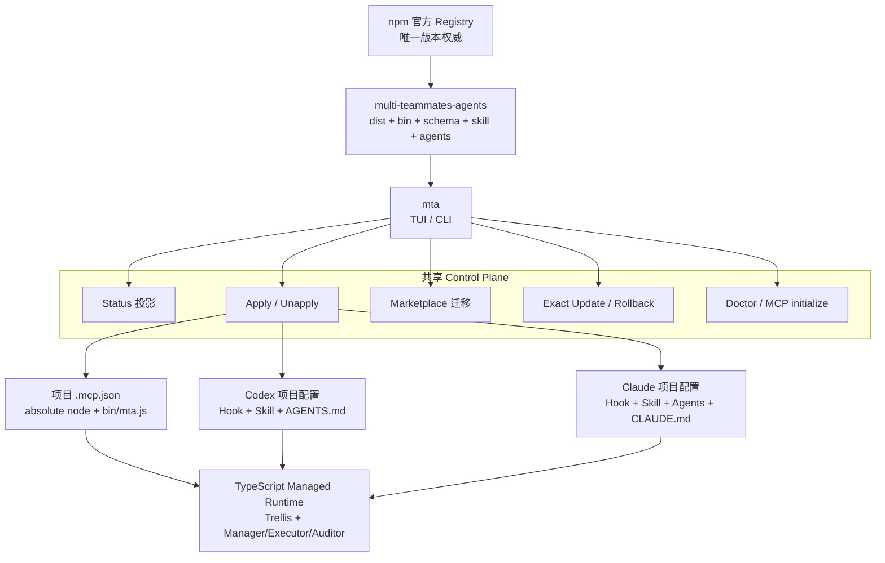
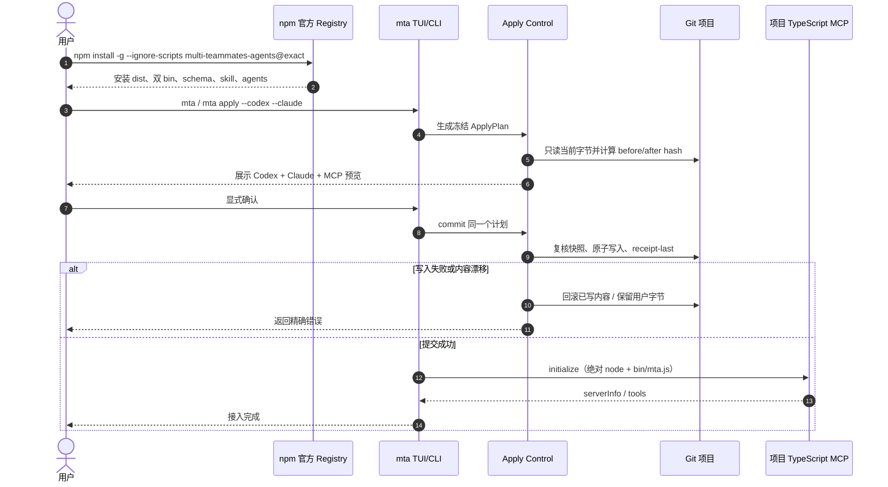
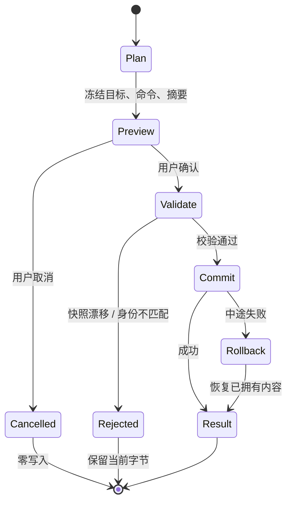
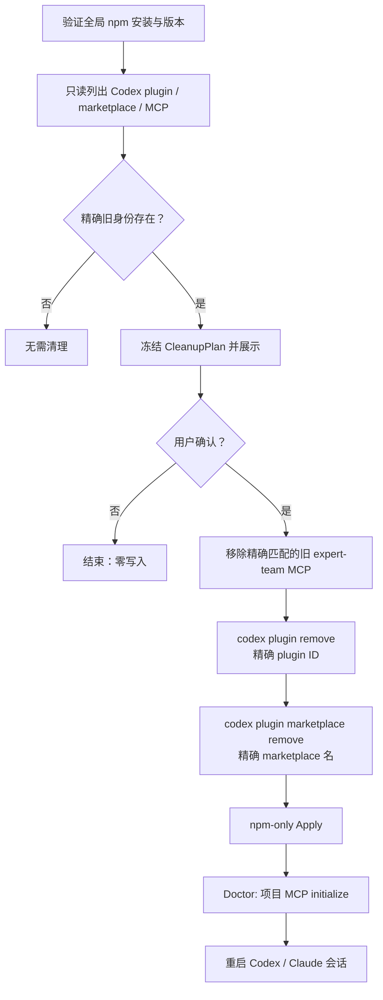
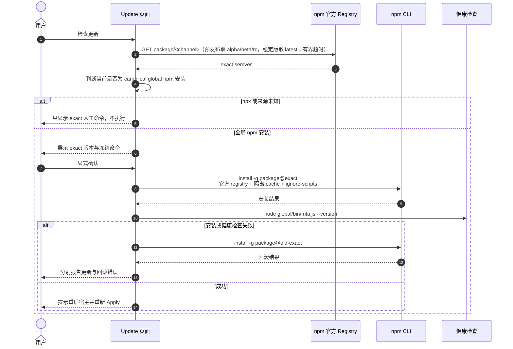

# MTA npm-only 控制面

## 结论

MTA 只有一个产品来源：npm 官方 registry 的 `multi-teammates-agents`。
Codex CLI 与 Claude Code 不再从 Git marketplace 缓存运行 MTA；两者由同一个
`mta` TUI/CLI 管理，并通过项目内配置调用已安装 npm 包的绝对 Node/JS 入口。

删除的是旧 Git plugin 根 MCP。Managed 模式需要的项目级 TypeScript MCP 继续保留，
由 `mta apply` 创建，并由 receipt、摘要校验、原子提交和漂移保护管理。

## 系统边界



不存在第二套 TUI 状态库或 shell 包装层。TUI 与 CLI 都直接调用 `src/control`、
`src/lifecycle` 和 `src/runtime` 的同一实现。

## 安装与项目接入



项目接入包含：

- Codex：`.codex/hooks.json`、`.agents/skills/expert-team`、`AGENTS.md`。
- Claude：`.claude/settings.json`、`.claude/skills/expert-team`、
  `.claude/agents`、`CLAUDE.md`。
- 共享：项目 `.mcp.json`、`.mta/runtime.json` 和 `.mta/apply-receipt.json`。

## 所有写操作的统一状态机



Apply、Unapply、旧 marketplace 清理和 Update 均遵守这个流程。计划生成后不会在
确认阶段静默重算成另一组目标。

## 旧 Git marketplace 迁移

迁移只识别以下精确身份：

```text
plugin      multi-teammates-agents@multi-teammates-agents
marketplace multi-teammates-agents
stale MCP  name=expert-team，且 launcher 与 cwd 同时指向 MTA plugin cache
```



清理不会扫描后猜删目录，也不会删除其他 marketplace、MCP 或用户配置。旧 run、
Trellis 任务和证据数据不属于这个迁移的删除范围。

## 精确更新与回滚



## TUI 页面

| 页面 | 读取内容 | 可执行操作 |
|---|---|---|
| Overview | 当前版本、安装来源、项目、双宿主、MCP、Trellis/run | 刷新与导航 |
| Integrations | Codex/Claude 接入、receipt、旧 plugin/marketplace | Apply、Unapply、迁移 |
| Update | 当前/可用版本、dist-tag 通道、来源、精确命令 | 检查、预览、确认更新 |
| Doctor | Node/npm/Git、Codex、Claude、项目 MCP initialize | 重新诊断 |
| Runs | 绑定任务和 managed run 快照 | status、resume、foreground 等现有操作 |

## 发布门禁

发布新 alpha 前必须依次通过：

1. TypeScript typecheck、lint 和全部单元/集成测试。
2. `npm pack` 内容检查：必须有 `dist`、双 bin、schema、skill、agents；不得有
   plugin manifest、根 `.mcp.json` 或 `bin/mta-plugin-mcp.js`。
3. 隔离 prefix 真安装：双 bin、npm exec、双宿主 Apply、Hook、项目 MCP initialize、
   Status、Doctor、Unapply。
4. Windows、Ubuntu、macOS Intel/arm64 × Node 22/24 CI。
5. 官方 registry 发布后验证全新安装、升级、失败回滚与新会话复验。

Alpha 通过上述门禁仍不等于 Stable。Stable 继续要求真实 Codex 与 Claude 的
model-backed managed E2E；fixture/fake-host 证据必须单独标注。
